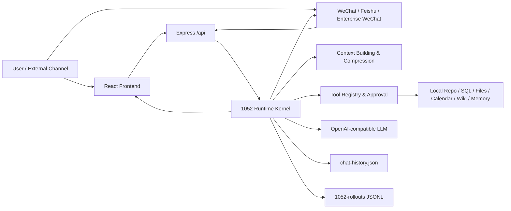
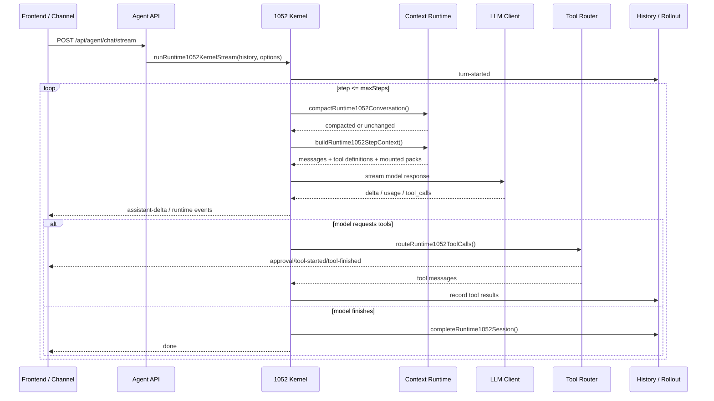
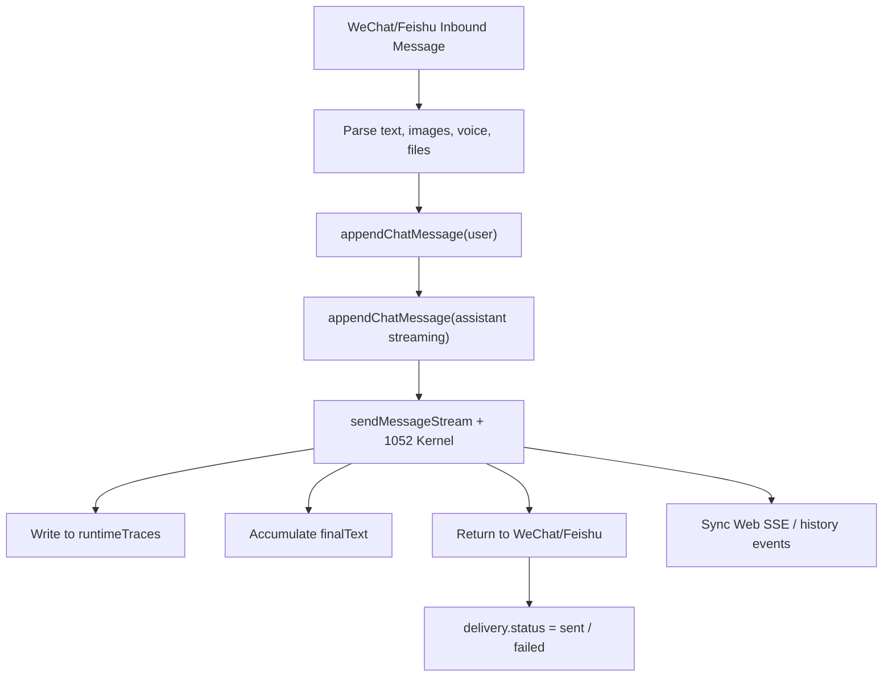

# 1052 OS

1052 OS is a local-first personal AI operating system. It integrates conversations, tool calling, long-term memory, knowledge bases, automated tasks, local repositories, SQL workbenches, and external channels like WeChat/Feishu into a single observable, approvable, and recoverable runtime.

The current version utilizes the "Today Console" as the homepage, with the core experience revolving around Agent conversations, the Runtime Loop, tool approvals, and the runtime inspector.

<p align="center">
  
</p>

<p align="center">
  <a href="https://github.com/1052666/1052-OS"></a>
  
  
  
</p>

## Table of Contents

- [Core Capabilities](#core-capabilities)
- [Interface Preview](#interface-preview)
- [Tech Stack](#tech-stack)
- [Project Structure](#project-structure)
- [Quick Start](#quick-start)
- [Configuration & Data Directory](#configuration--data-directory)
- [System Architecture](#system-architecture)
- [Runtime Loop Technical Flow](#runtime-loop-technical-flow)
- [Context Compression Mechanism](#context-compression-mechanism)
- [Tool System & Approval](#tool-system--approval)
- [External Channel Loop](#external-channel-loop)
- [Frontend Architecture](#frontend-architecture)
- [Backend API Modules](#backend-api-modules)
- [Testing & Verification](#testing--verification)
- [Development Conventions](#development-conventions)

## Core Capabilities

### Today Console

- Aggregates schedules, scheduled tasks, notifications, recent memories, runtime status, and quick input.
- Supports initiating Agent conversations directly from the homepage.
- Localized degradation when a single module request fails, preventing the entire homepage from crashing.

### Agent Conversation

- Conversation content is the primary focus, with execution details displayed as collapsed "Runtime Traces."
- Tool calls, approvals, context upgrades, compression, errors, and completion states are all logged in the Runtime Trace.
- User messages use a lightweight text layout; Agent replies support Markdown, code blocks, tables, mathematical formulas, and attachments.
- Long conversations provide a one-click "back to bottom" button, allowing history reading and following new messages without interference.

### Workspace

- Local repository indexing, file viewing, and repository descriptions.
- SQL data sources, SQL files, variables, SSH servers, Shell files, and a query workbench.
- Orchestration tasks can connect SQL, Shell, wait, and debug nodes.

### Knowledge System

- Notes, Wiki, PKM, Resource Library, Long-term Memory, Sensitive Long-term Memory, and Output Profiles.
- Wiki is used for source materials and structured knowledge; Memory is used for user preferences, long-term facts, and reusable context.
- Output Profiles define the Agent's expression style, cognitive models, and material scope for specific scenarios.

### Automation

- Calendar events and scheduled tasks.
- Execution records, notification center, and task result write-backs.
- Flow orchestration supports visual editing, with complex editors lazy-loaded via routing.

### Capabilities & Connectivity

- Skills, UAPIs, search sources, and toolboxes.
- Official WeChat Bot channel, Feishu event/card channel, and Enterprise WeChat Webhooks.
- External channels share the same Agent Runtime as the web version rather than maintaining independent bot logic.

## Interface Preview

| Today Console | Agent Conversation |
| --- | --- |
|  |  |

| Workspace | Automation |
| --- | --- |
|  |  |

## Tech Stack

### Frontend

- React 18 + Vite + TypeScript strict mode
- React Router
- TanStack Query
- Zustand
- Zod
- Radix UI
- Lucide React
- Motion
- React Hook Form
- CodeMirror
- TanStack Table / Virtual
- React Flow
- Mermaid / KaTeX / Markdown rendering

### Backend

- Node.js + Express + TypeScript ESM
- Zod contract validation
- better-sqlite3
- MySQL / SSH2
- SSE streaming events
- Local JSON file storage
- WeChat, Feishu, and Enterprise WeChat channel modules

## Project Structure

```text
.
├── backend/                    # Express API, Agent Runtime, tools, and channels
│   ├── prompts/                # Agent system prompts
│   └── src/
│       ├── modules/agent/      # 1052 Runtime, context, tools, approvals, history
│       ├── modules/channels/   # WeChat, Feishu, Enterprise WeChat
│       ├── modules/settings/   # Settings for models, Agents, appearance, etc.
│       ├── modules/sql/        # SQL data sources, queries, variables, Shell
│       ├── modules/wiki/       # Wiki knowledge base
│       ├── modules/memory/     # Long-term memory
│       └── app.ts              # API route assembly
├── frontend/                   # New version frontend
│   └── src/
│       ├── app/                # Routes, navigation, QueryClient
│       ├── components/         # Shell, Chat, UI primitives
│       ├── contracts/          # Zod API contracts
│       ├── data/               # ApiClient
│       ├── features/           # Workspace, knowledge, automation, capabilities
│       ├── pages/              # today/chat/workspace/knowledge/...
│       ├── runtime/            # SSE reducer and Runtime Trace
│       ├── state/              # Zustand state
│       └── styles/             # Design tokens, base styles, themes
├── docs/                       # Design specifications and runtime documentation
├── assets/readme/              # README screenshot assets
└── data/                       # Local runtime data, excluded by default
```

## Quick Start

### Prerequisites

- Node.js 20+
- npm
- Windows, macOS, or Linux
- Access to an OpenAI-compatible LLM service, or a configured local model proxy

### Install Dependencies

```bash
cd backend
npm install

cd ../frontend
npm install
```

### Start Backend

```bash
cd backend
npm run dev
```

Default listener:

```text
http://localhost:10053
```

Health check:

```bash
curl http://localhost:10053/api/health
```

### Start Frontend

```bash
cd frontend
npm run dev
```

Default access:

```text
http://localhost:10052
```

The frontend Vite proxy forwards `/api/*` to `http://localhost:10053`. If the backend address is different, you can set:

```bash
BACKEND_URL=http://localhost:10053 npm run dev
```

PowerShell example:

```powershell
$env:BACKEND_URL="http://localhost:10053"
npm run dev
```

## Configuration & Data Directory

The backend writes user data to the `data/` directory in the repository root by default, which is excluded by `.gitignore`.

Common files:

| Path | Description |
| --- | --- |
| `data/settings.json` | Settings for models, Agents, appearance, channels, etc. |
| `data/chat-history.json` | Current conversation history |
| `data/chat-history-backups/` | Backups produced by `/new` and compression history |
| `data/1052-rollouts/` | Event logs for each 1052 Runtime run |
| `data/research/research-sessions.sqlite` | Multi-turn research sessions, result states, and query sources |
| `data/logs/` | Backend runtime logs |
| `data/channels/wechat/` | WeChat channel accounts, media, and status |
| `data/channels/feishu/` | Feishu channel config, media, and status |
| `data/generated-images/` | Static assets for generated images |

The data directory can be overridden via environment variables:

```bash
DATA_DIR=/absolute/path/to/data npm run dev
```

The port can be overridden via `PORT`:

```bash
PORT=10053 npm run dev
```

## System Architecture



Core Principles:

- The web version, WeChat, Feishu, and scheduled tasks share the same Agent Runtime.
- Tool calling is not a hidden action but a Runtime event that can be displayed, approved, and recorded.
- Conversation history, settings, memory, and files are kept locally in `data/` by default.
- The channel layer does not impose a fixed 10-minute task timeout; task lifecycles are controlled by the Runtime, user cancellation, model stream completion, or the specific tool's local timeout.

## Runtime Loop Technical Flow

The 1052 Runtime is located in `backend/src/modules/agent/1052-kernel.ts`. It is responsible for advancing a single user input into a complete Agent turn.



Key Events:

| RuntimeEvent | Meaning |
| --- | --- |
| `turn-started` | New turn started |
| `step-started` | New model step started, including tool packs and context budget |
| `assistant-delta` | Model streaming text output |
| `model-response` | Model completed a sampling, possibly containing tool calls |
| `tool-call-started` | Tool began execution |
| `tool-call-finished` | Tool completed or failed |
| `approval-requested` | User approval required |
| `context-upgrade-*` | Context pack upgrade |
| `conversation-compacted` | Conversation context has been compressed |
| `usage-recorded` | Token usage recorded |
| `turn-aborted` | Turn cancelled or model stream exception |

`frontend/src/runtime/runtime.ts` normalizes SSE events into a displayable Runtime Trace, which the chat page then collapses beneath the Agent's reply.

## Context Compression Mechanism

Compression in 1052 OS is not simple message deletion, but rather a checkpoint designed for resuming long tasks.

Implementation Files:

- `backend/src/modules/agent/1052-context-policy.ts`
- `backend/src/modules/agent/1052-compaction-runtime.ts`
- `backend/src/modules/agent/1052-context-runtime.ts`
- `docs/1052-runtime-context-compaction.md`

Process:

1. The Runtime estimates the current session tokens before each step.
2. Once the automatic compression line is reached, a continuation summary is generated.
3. The new context consists of "most recent real user messages" and the "compression summary message."
4. The Runtime emits a `conversation-compacted` event, which appears as a runtime trace in the frontend.
5. If the summary model fails, the system retains the most recent tail window and marks a fallback to avoid interrupting the user's task.

Default Policy:

| Item | Default Value | Description |
| --- | ---: | --- |
| Active Message Window | 160 messages | Max recent valid messages brought in per turn |
| Auto-Compression Line | 80,000 tokens | Triggers summary compression upon reaching |
| User Message Retention Budget | 8,000 tokens | Priority given to original user intent after compression |
| Summary Chunk Size | 32,000 chars | Chunks ultra-long transcripts for summary |
| Fallback Tail Window | 60 messages | Retains recent messages if summary fails |

"Max Context Messages" and "Auto-Compression Threshold" from old settings can still be read by the backend, but the new settings page no longer exposes these to general users, as the runtime uses an automatic policy.

## Tool System & Approval

Tools are registered centrally in `backend/src/modules/agent/1052-tool-registry.ts` and executed via `1052-tool-router.ts`.

Tool metadata includes:

- Tool name
- Read/Write safety classification
- Whether it has side effects
- Whether it requires confirmation
- Whether it supports parallelism
- Whether it has its own local timeout

Permission Model:

| Mode | Behavior |
| --- | --- |
| Default Mode | Read operations execute directly; writing, deleting, terminal, SQL writes, external messages, etc., require approval |
| Full Access | Allows automatic confirmation of tools with side effects when explicitly enabled by user |
| Read-only | Blocks tools with side effects |

Design Highlights:

- Global tool execution no longer uses a fixed 25-minute `Promise.race` timeout.
- `claude_code` is no longer forcibly killed by 1052 OS after 10 minutes; it waits for the CLI to finish.
- Terminal commands, network requests, QR code logins, and approval waits still retain their necessary local timeouts.
- Tool output is wrapped in `{ ok, data }` or `{ ok: false, error }` before being fed back into the model context.
- Ultra-long tool output is truncated and accompanied by a `_hint`, prompting the model to narrow the next query.

## Multi-turn Research Sessions

Complex comparisons, cross-source verification, and research reports no longer rely on one-off `websearch_search` calls. `search-pack` provides persistent research sessions, allowing the web version, WeChat, Feishu, and scheduled tasks to continue the same research via a `sessionId`:

| Tool | Function |
| --- | --- |
| `websearch_research_start` | Creates a research topic and persistent Session |
| `websearch_research_search` | Performs a search round within a Session and accumulates sources |
| `websearch_research_status` | Views rounds, quality, snapshots, Claims, Evidence, Reviews, and write-back records |
| `websearch_research_review` | Marks search results as `pending`, `approved`, or `rejected` |
| `websearch_research_extract` | Extracts page body and generates an immutable source snapshot |
| `websearch_research_assess` | Evaluates body depth, source diversity, and novelty, and suggests next-round queries |
| `websearch_research_claim_create` | Breaks down conclusions to be verified into atomic Claims |
| `websearch_research_evidence_candidates` | Finds evidence candidates with character offsets from approved sources |
| `websearch_research_evidence_add` | Anchors supporting, contradicting, or insufficient evidence to a specific snapshot |
| `websearch_research_claim_review` | Performs independent source, conflict, and risk rule audits |
| `websearch_research_writeback` | Writes only approved Claims and evidence to Wiki and rebuilds PKM index |

Research results default to `pending` and are not treated as verified evidence immediately. URLs are normalized and common tracking parameters are removed; duplicate sources keep only one result node. When the same source appears across multiple query rounds, Reciprocal Rank Fusion is used to accumulate rankings while retaining the round, rank, and original score for each.

The subsequent closure loop has three layers. Web page bodies are saved as immutable snapshots with SHA-256 records; Evidence must precisely match character offsets in the snapshot and cannot reference subsequently changed page content. Claim Review only passes automatically when at least two independent sources fully support it and there is no contradicting evidence; high-risk, single-source, conflicting, or insufficient evidence stays in `needs_review`. The final Wiki / PKM write-back re-checks Claim Review and source status, refusing to solidify pending or conflicting content as knowledge.

State is saved in `data/research/research-sessions.sqlite`. SQLite uses WAL, foreign keys, and transactions to prevent JSON overwriting during concurrent additions from web, external channels, or scheduled tasks. Completed Sessions are read-only. Web extraction only accepts public HTTP(S) addresses, performing hop-by-hop checks on redirects, response types, a 2 MB size limit, and local timeouts.

The frontend entry point is "Knowledge → Deep Research," fully displaying search rounds, engine failures, quality metrics, source audits, Claim / Evidence / Review, and Wiki / PKM write-back traces. For detailed data models, interfaces, and failure semantics, see [Deep Research Evidence Closure](docs/1052-deep-research-closure.md).

## External Channel Loop

WeChat and Feishu are not independent bots; they convert external messages into the same Chat History and Runtime stream.



Channel Strategy:

- Inbound messages are written to `data/chat-history.json`, and the web version syncs via history events.
- Tool calls, approvals, and compression events enter the message `meta.runtimeTraces`.
- If the model stream is interrupted at the end but has already generated content, the channel sends the generated content first and marks the web state as "sent" rather than "runtime failure."
- The channel layer no longer has a 10-minute overall turn timeout; long tasks are controlled by the Runtime and specific tools.
- Markdown document code fences are unwrapped before being sent to external channels to avoid WeChat/Feishu receiving a block wrapped in ```markdown.

## Frontend Architecture

The new frontend is located in `frontend/src`, maintained in layers of contracts, data access, feature pages, and component styles.

Routes:

| Path | Page |
| --- | --- |
| `/today` | Today Console |
| `/chat` | Agent Conversation |
| `/workspace/*` | Local Repo, SQL, Data Sources, Shell |
| `/knowledge/*` | Notes, Wiki, Memory, PKM, Resources, Output Profiles |
| `/automations/*` | Calendar, Scheduled Tasks, Orchestration, Execution Records |
| `/capabilities/*` | Skills, Toolbox, Search Sources, External Channels |
| `/settings/*` | Models, Agent Permissions, Appearance, System Maintenance |

Implementation Conventions:

- `contracts/schemas.ts` defines Zod request/response contracts.
- `data/api.ts` provides a unified ApiClient.
- `runtime/runtime.ts` manages SSE streams, cancellations, and the Runtime Trace reducer.
- `components/shell` handles main navigation, command palette, runtime inspector, and system fields.
- `styles/tokens.css`, `styles/base.css`, and CSS Modules together form the styling system.
- Heavy modules like CodeMirror, React Flow, and Mermaid are lazy-loaded by route.

## Backend API Modules

Main routes are assembled in `backend/src/app.ts`:

| Route Prefix | Module |
| --- | --- |
| `/api/settings` | Settings, model integration, local model discovery |
| `/api/agent` | Conversation, SSE, approval, upload, history, migration, usage |
| `/api/calendar` | Calendar and scheduled tasks |
| `/api/repository` | Local repository |
| `/api/notes` | Notes |
| `/api/wiki` | Wiki |
| `/api/pkm` | PKM retrieval |
| `/api/memory` | Long-term memory |
| `/api/resources` | Resource library |
| `/api/output-profiles` | Output profiles |
| `/api/sql` | SQL data sources, queries, files, variables, servers |
| `/api/orchestration` | Flow orchestration |
| `/api/websearch` | Search sources and page reading |
| `/api/skills` | Skill management |
| `/api/uapis` | UAPI tools |
| `/api/appearance` | Appearance themes |
| `/api/channels/wechat` | Official WeChat Bot channel |
| `/api/channels/feishu` | Feishu events and card channel |
| `/api/channels/wecom` | Enterprise WeChat Webhook |
| `/api/logs` | Backend runtime logs |

## Testing & Verification

### Backend

```bash
cd backend
npm run test
npm run build
```

Common targeted tests:

```bash
npm run test -- 1052-kernel 1052-tool-runtime agent.history.service
npm run test -- channel-text channel-media-extraction agent.runtime-traces
```

### Frontend

```bash
cd frontend
npm run test
npm run build
```

Common visual and interaction checks:

```bash
npm run test:visual
npm run test:interactions
npm run test:e2e
```

### Local Integration

1. Run `npm run dev` in the `backend/` directory.
2. Run `npm run dev` in the `frontend/` directory.
3. Open `http://localhost:10052`.
4. Configure the model in the settings page.
5. Start a conversation in `/chat` and check the runtime trace, tool calls, and the runtime inspector on the right.

## Development Conventions

- Do not commit `data/`, logs, build artifacts, or local reference repositories.
- Do not place locally cloned `codex/` or `codex-official-release-*` folders inside the 1052 OS repository.
- New frontend capabilities should be placed in the new `frontend/src/features` or `frontend/src/pages` first.
- New backend Agent capabilities should first be integrated into the 1052 Runtime, tool registry, and Zod contracts.
- Migrations involving user assets must keep `data/` recoverable; no silent destructive cleanup.
- Automate settings for general users as much as possible; keep complex parameters in runtime policies rather than exposing them directly.

## Community

- GitHub: <https://github.com/1052666/1052-OS>
- Telegram: <https://t.me/OS1052>

<p>
  
</p>
