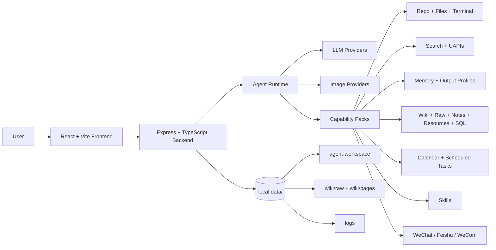

<p align="center">
  <a href="https://github.com/1052666/1052-OS">
    
  </a>
</p>

<h1 align="center">1052 OS</h1>

<p align="center">
  <a href="./README.md">中文</a>
</p>

<p align="center">
  <strong>A local-first, tool-driven personal AI agent workspace with native social-channel integrations</strong>
</p>

<p align="center">
  An actively iterating desktop-style AI workspace that puts chat, tools, memory, knowledge, tasks, search, social channels and your local working directory inside a single, fully controllable environment.
</p>

<p align="center">
  <a href="https://github.com/1052666/1052-OS/stargazers"></a>
  <a href="https://github.com/1052666/1052-OS/network/members"></a>
  <a href="https://github.com/1052666/1052-OS/graphs/contributors"></a>
  <a href="./LICENSE"></a>
</p>

<p align="center">
  
  
  
  
  
</p>

---

## Join the Community

<table>
  <tr>
    <td width="280" valign="top">
      
    </td>
    <td valign="top">
      <h3>Discussion, feedback, testing and co-building</h3>
      <p><strong>Telegram:</strong> <a href="https://t.me/OS1052">https://t.me/OS1052</a></p>
      <p><strong>WeChat group:</strong> Scan the QR code on the left to join the closed-beta group</p>
      <p><strong>GitHub:</strong> <a href="https://github.com/1052666/1052-OS">https://github.com/1052666/1052-OS</a></p>
      <p>Bug reports, real-world feedback, feature requests, custom Skills, tooling proposals and case studies are all welcome.</p>
    </td>
  </tr>
</table>

---

## Project Status

1052 OS is no longer just a chat page — it is a complete AI agent workspace built around local workflows. It consolidates the following capabilities into a single system:

- A chat-style Agent with progressive-disclosure capability packs
- Local file system, repository browsing, terminal, SQL and task pipelines
- Long-term memory, Wiki, resource library, notes and output profiles
- Web search, the UAPIs toolbox and the Skill center
- Calendar, scheduled tasks and a unified notification center
- Social channels: WeChat, Feishu (Lark), WeCom and more

The current release focuses on:

- Letting the Agent actually touch your local workspace instead of only talking inside a chat box
- Making tool calls, permissions, context and accumulated data visible, controllable and traceable
- Letting the web UI, scheduled tasks, WeChat and Feishu entry points share the exact same Agent capabilities
- Keeping runtime data inside the local `data/` directory by default, instead of scattered across third-party services

---

## Project Preview

<table>
  <tr>
    <td width="50%" valign="top">
      
      <br />
      <strong>Chat Workspace</strong>
      <br />
      Streaming output, collapsible thinking blocks, Markdown / Mermaid / LaTeX rendering, automatic context compression, token statistics, live tool execution status and a unified chat history.
    </td>
    <td width="50%" valign="top">
      
      <br />
      <strong>Files, Notes, Resources</strong>
      <br />
      Local file editing, repository browsing, note tree, resource cards, Wiki source materials and a managed Agent workspace — all in one place.
    </td>
  </tr>
  <tr>
    <td width="50%" valign="top">
      
      <br />
      <strong>Search, Skills, Toolbox</strong>
      <br />
      Aggregated web search, full-page reader, the UAPIs toolbox, the Skill marketplace and capability packs that mount on demand.
    </td>
    <td width="50%" valign="top">
      
      <br />
      <strong>Schedules + Social Channels</strong>
      <br />
      Calendar, scheduled tasks, the notification center, plus outbound channels through WeChat, Feishu and WeCom.
    </td>
  </tr>
</table>

---

## Core Capabilities

| Module | What you get today |
| --- | --- |
| Chat | OpenAI-compatible chat API, SSE streaming, collapsible thinking, Markdown rendering, context compression, token statistics, unified chat history |
| Agent Runtime | P0 routing, capability-pack mounting, checkpoints, budget reports, tool progress events, tool execution timeouts |
| LLM Configuration | Multi-model presets, per-task routing, provider auto-detection. Default preset: `1052 API` |
| Image Generation | OpenAI-compatible `/images/generations`, Gemini native, Gemini OpenAI-compatible |
| File System | Search, read, create, replace, insert, copy, move, delete — designed for precise project maintenance |
| Repository | Local project detection, README preview, directory browsing, source view, image preview, repo packaging/export |
| Terminal | Read-only and execution terminals are split, multi-shell support, working-directory switching, status tracking, interrupt |
| Notes | Real file tree, Markdown editing, preview, search, drag-and-drop, directory management |
| Resource Library | Structured storage of titles, body, notes, tags, status, links and long-form materials |
| Long-term Memory | Regular memory, secure memory, memory suggestions, runtime injection and confirmation flows |
| Output Profiles | Combine cognitive models, writing styles and source scopes into reusable output recipes |
| Wiki | Raw materials, structured pages, WikiLinks, indexing, lint, synthesis writing and knowledge accumulation |
| Search | Aggregated web search, full-page reading, source management, online verification chains |
| Skill Center | Install, remove, preview and hot-update local Skill packs |
| UAPIs Toolbox | API catalog, endpoint detail reading, structured invocation, per-card enable/disable |
| Calendar & Tasks | Regular events, one-off / recurring / long-running tasks, Agent callbacks, terminal tasks, result write-back |
| WeChat Desktop Channel | Dedicated channel panel, group listening, group-level prompts, group permissions, group memory, outbound sending |
| WeChat QR Channel | QR login, reconnect, text + media handling, task push |
| Feishu / WeCom | Basic message delivery, bot integration, notification linking |
| Logs & Runtime Data | All runtime data lands in the local `data/` directory for easy debugging and migration |

---

## Architecture Overview



### Frontend

- React 18
- Vite 5
- TypeScript
- React Router
- React Markdown
- Mermaid
- KaTeX
- Vitest

### Backend

- Node.js
- Express
- TypeScript
- SSE streaming
- OpenAI-compatible chat & image endpoints
- Gemini native image endpoint
- Feishu / WeChat / WeCom channel services
- Local JSON data storage

---

## Setup From Scratch

### 1. Requirements

Recommended:

- Node.js 20+
- npm 10+
- Git

Supported platforms:

- Windows
- macOS
- Linux

Optional:

- A working chat-model API key
- An image generation API key
- Feishu / WeChat / WeCom development credentials
- A UAPIs API key

SQL features additionally require:

- Python 3.10+
- `uv`

If you don't plan to use SQL queries or orchestration, Python and `uv` are not needed.

### 2. Clone the repository

```bash
git clone https://github.com/1052666/1052-OS.git
cd 1052-OS
```

### 3. Install backend dependencies

```bash
cd backend
npm install
```

### 4. Install frontend dependencies

```bash
cd ../frontend
npm install
```

### 5. Start the backend

```bash
cd ../backend
npm run dev
```

Default address:

```text
http://localhost:10053
```

Health check:

```bash
curl http://localhost:10053/api/health
```

### 6. Start the frontend

In a second terminal:

```bash
cd frontend
npm run dev
```

Default address:

```text
http://localhost:10052
```

### 7. First-time LLM setup

Open the Settings page and configure at minimum:

- LLM Base URL
- Model ID
- API Key
- Whether to enable streaming output
- Chat context window size
- Agent permissions and progressive-disclosure switch

The default preset has been updated to:

| Name | Base URL | Model ID |
| --- | --- | --- |
| 1052 API | `https://api.lxj.asia/v1` | `deepseek-v4-flash-search` |

Get an API key:

- `https://api.lxj.asia/register?aff=UOBG`

The Settings page also ships with built-in presets for:

- OpenAI
- MiniMax
- Gemini OpenAI
- DeepSeek
- Moonshot
- OpenRouter
- SiliconFlow
- Zhipu

### 8. Configure image generation

Image generation supports these providers:

| API format | Example Base URL | Notes |
| --- | --- | --- |
| OpenAI compatible | `https://api.openai.com/v1` | Auto-appends `/images/generations` |
| MiniMax image | `https://api.minimaxi.com` | Auto-appends `/v1/image_generation`; also accepts a `/v1` suffix |
| Gemini native | `https://generativelanguage.googleapis.com/v1beta` | Auto-appends `generateContent` |
| Gemini OpenAI compatible | `https://generativelanguage.googleapis.com/v1beta/openai` | Uses Gemini's OpenAI-compatible image endpoint |

Generated images are stored under:

```text
data/generated-images/
```

---

## WeChat Desktop Channel

The current build ships a dedicated WeChat desktop channel panel that is fully separated from the legacy QR-login WeChat entry.

Key capabilities:

- Bind to a specific group chat window
- Independent listener start/stop
- Per-group permission switches
- Per-group prompt appendix
- Per-group memory read/write
- `@bot` mentions inside group chats trigger the Agent
- Other channels can proactively send WeChat messages through the Agent

Listener strategy:

- Immediate check on startup
- Polling roughly every `1 s`
- Batch-merge window of about `1.5 s`
- Keeps the chat list pinned to the bottom
- Lightweight refocus of the bound window roughly every `25 s`

Notes:

- Desktop WeChat automation currently runs on Windows only
- The Python bridge and the `pywechat` solution are bundled inside the project's `vendor/` directory

---

## Data Directory

All runtime data lives under the project's `data/` directory. It is created automatically on first run.

Typical layout:

```text
data/
|-- agent-workspace/
|-- channels/
|-- generated-images/
|-- logs/
|-- memory/
|-- notes/
|-- resources/
|-- skills/
|-- wiki/
|   |-- raw/
|   `-- wiki/
|-- chat-history.json
`-- settings.json
```

Things you typically should NOT commit to GitHub:

- `data/`
- `node_modules/`
- `dist/`
- `.env`
- Local logs
- Model API keys
- Channel session credentials
- Chat history

---

## How the Agent Works

The 1052 OS Agent doesn't simply forward your messages to a model. It dynamically composes the runtime pipeline based on permissions, the task, the context budget and which capability packs are mounted:

1. The user makes a request from the web UI, WeChat, Feishu or a scheduled task
2. The backend injects the system prompt, runtime state, permission mode, memories, the active output profile and a context summary
3. The P0 layer decides whether the current task needs additional capability packs
4. It mounts the necessary packs on demand: `repo-pack`, `search-pack`, `memory-pack`, `data-pack`, `plan-pack`, `skill-pack`, `channel-pack`
5. It executes tool calls and feeds the results back to the model for further reasoning
6. The final answer is written back to the chat stream, the notification center or an external social channel

This design is built for real work, for example:

- Reading a repository and summarising how to run it
- Editing a few lines of configuration in a local file
- Organising materials into the resource library or the Wiki
- Triggering the Agent or a terminal command from a scheduled task
- Asking the model from the web UI to actively send a WeChat message
- Handling group messages with group-level memory and prompts

---

## Permission Model

1052 OS defaults to a conservative permission posture:

- Read, search, preview and status checks usually run without confirmation
- Write, delete, overwrite, install, outbound send and command execution require explicit confirmation when "full access" is OFF
- You can flip on "Full Access" inside the Settings page
- Long-term memory and sensitive data are layered separately to avoid leaking secrets or session credentials into ordinary context

---

## Search, Skills and Toolbox

### Search

The project supports:

- Aggregated web search
- Full-page reading
- Source management
- Cross-validation through UAPIs search endpoints

As a rule of thumb, anything that changes over time should be verified online — for example:

- News
- Prices
- Product specs
- API documentation
- Platform rules
- People / role changes

### Skill Center

A Skill is essentially an installable capability pack. A typical Skill is composed of:

- `SKILL.md`
- Scripts
- Templates
- Reference docs
- Auxiliary resources

The project supports:

- Listing installed Skills
- Searching the Skill marketplace
- Installing / removing Skills
- Previewing Skill documents

### UAPIs Toolbox

The UAPIs toolbox renders the API catalog as visual cards. The Agent never ingests every API spec at once — it first reads a lightweight index, then opens specific APIs as needed.

Recommended call sequence:

1. `uapis_list_apis`
2. `uapis_read_api`
3. `uapis_call`

---

## Local Development Commands

Backend:

```bash
cd backend
npm run build
npm test
npm run dev
```

Frontend:

```bash
cd frontend
npm run build
npm test
npm run dev
```

Default ports:

```text
Frontend: http://localhost:10052
Backend:  http://localhost:10053
```

---

## Directory Layout

```text
1052-OS/
|-- assets/
|   `-- readme/
|-- backend/
|   |-- prompts/
|   |-- scripts/
|   `-- src/
|       |-- modules/
|       |-- app.ts
|       `-- index.ts
|-- docs/
|-- frontend/
|   `-- src/
|       |-- api/
|       |-- components/
|       |-- pages/
|       `-- styles.css
|-- vendor/
|-- LICENSE
|-- README.md
`-- README.en.md
```

Generated automatically at runtime:

```text
data/
```

---

## Contributors

Thanks to everyone who has tested, given feedback, contributed designs, opened pull requests or co-built features.

<p>
  <a href="https://github.com/1052666/1052-OS/graphs/contributors">
    
  </a>
</p>

This list is updated automatically by GitHub. If your contributions don't show up, the most common reason is that the commit email isn't yet linked to your GitHub account.

---

## Stars and Growth

<p align="center">
  <a href="https://star-history.com/#1052666/1052-OS&Date">
    
  </a>
</p>

---

## FAQ

### 1. Can I start the project without an API key?

Yes — the frontend, backend and most local panels boot without any key, but Agent chat requires at least one working LLM API key.

### 2. What is the current default model?

The default preset is:

- `1052 API`
- Base URL: `https://api.lxj.asia/v1`
- Model ID: `deepseek-v4-flash-search`

### 3. Should I commit `data/`?

No. `data/` is the runtime directory and contains settings, logs, chat history, memories, resources, Skills, the Wiki, channel state and other local-only data.

### 4. Which platforms support the WeChat desktop channel?

The desktop WeChat automation channel is Windows-first. On other platforms you can keep using the web panel, Feishu, the QR-login WeChat channel and the rest of the system.

### 5. What are the default ports?

- Frontend: `10052`
- Backend: `10053`

---

## License

This project is licensed under the [MIT License](./LICENSE).
