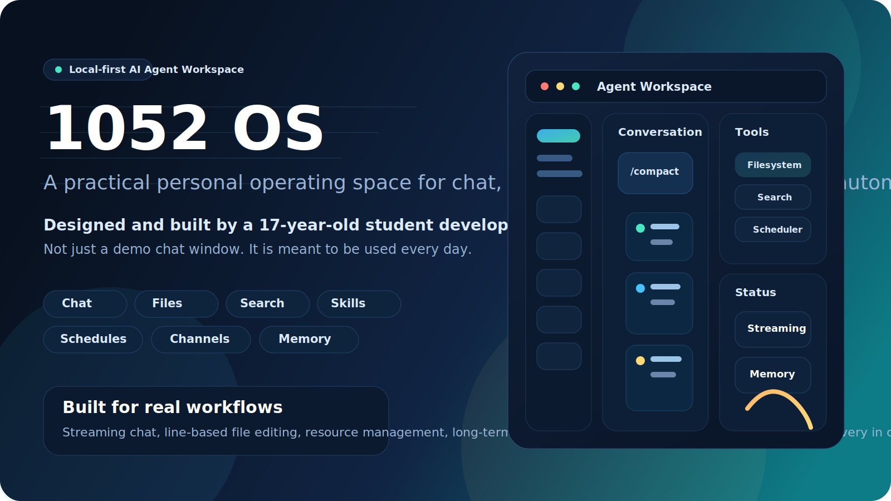
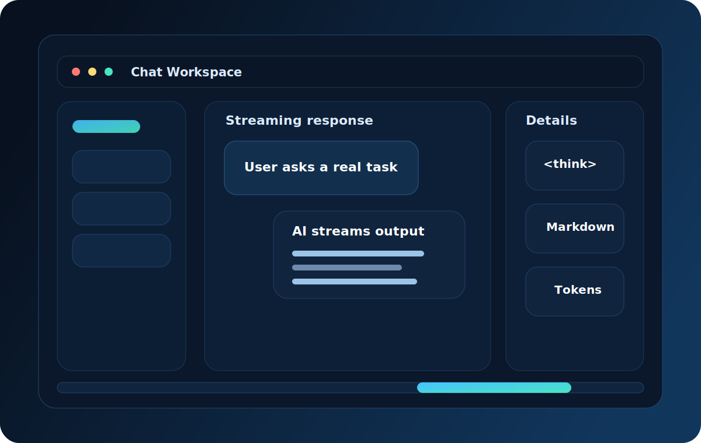
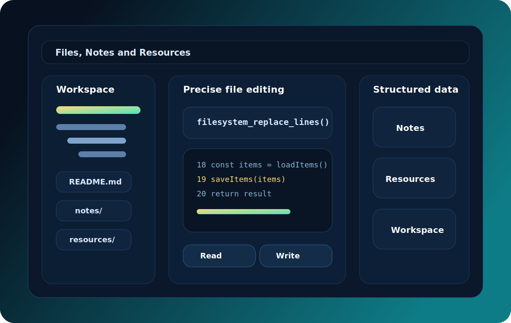
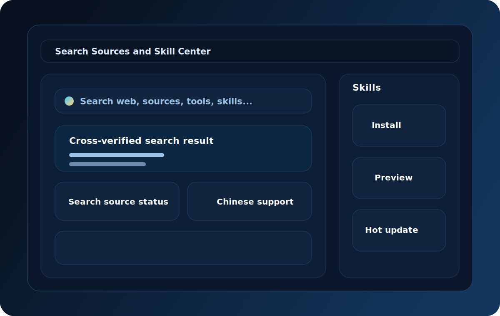
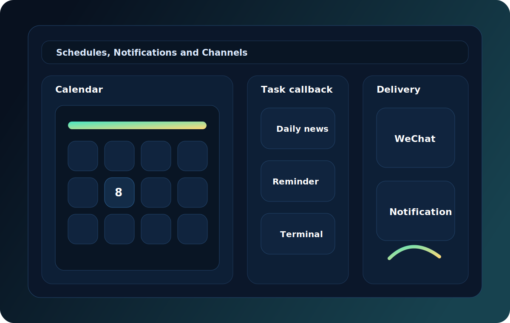
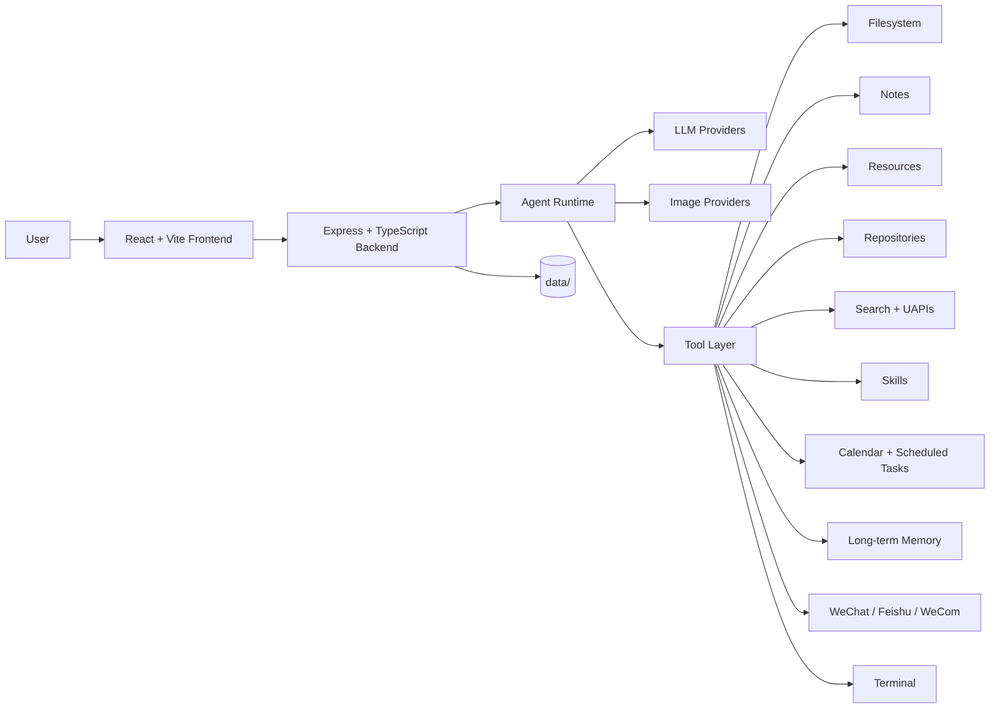

<p align="center">
  <a href="https://github.com/1052666/1052-OS">
    
  </a>
</p>

<h1 align="center">1052 OS</h1>

<p align="center">
  中文 | <a href="./README.en.md">English</a>
</p>

<p align="center">
  <strong>一个本地优先、工具驱动、可接入社交通道的 AI Agent 工作台。</strong>
</p>

<p align="center">
  由一名 17 岁学生开发者持续设计、开发与迭代。
</p>

<p align="center">
  <a href="https://github.com/1052666/1052-OS/stargazers"></a>
  <a href="https://github.com/1052666/1052-OS/network/members"></a>
  <a href="https://github.com/1052666/1052-OS/graphs/contributors"></a>
  <a href="./LICENSE"></a>
</p>

<p align="center">
  
  
  
  
  
</p>

---

## 加入社区

<table>
  <tr>
    <td width="280" valign="top">
      
    </td>
    <td valign="top">
      <h3>第一时间交流、反馈和参与测试</h3>
      <p><strong>Telegram 群组：</strong><a href="https://t.me/OS1052">https://t.me/OS1052</a></p>
      <p><strong>微信群：</strong>扫描左侧二维码加入 <code>1052内测测测群</code></p>
      <p>欢迎提交 Bug、体验反馈、功能建议、PR 和新的 Skill / 工具方案。</p>
      <p><strong>GitHub 仓库：</strong><a href="https://github.com/1052666/1052-OS">https://github.com/1052666/1052-OS</a></p>
    </td>
  </tr>
</table>

---

## 项目状态

1052 OS 当前已经不是单纯的聊天页面。它把 AI 对话、模型接入、本地文件、仓库阅读、笔记、资源库、长期记忆、联网搜索、UAPIs 工具箱、Skill 中心、定时任务、通知中心、微信、飞书、企业微信、图像生成、SQL 工作台和可视化编排放进同一个桌面式工作台里。

它的设计目标很明确：

- 让 Agent 能接触真实工作区，而不是只在聊天框里空谈。
- 让用户自己掌握权限，默认保守，需要时可开启完全权限。
- 让所有重要数据优先留在本地 `data/` 目录。
- 让模型、搜索源、工具、Skill、社交通道都可以被用户看见、配置和控制。
- 让微信、飞书等外部消息也能回到同一个聊天上下文里，避免多平台割裂。

---

## 项目预览

<table>
  <tr>
    <td width="50%" valign="top">
      
      <br />
      <strong>Chat Workspace</strong>
      <br />
      流式输出、思考折叠、Markdown、Mermaid、数学公式、上下文压缩、Token 统计和统一聊天历史。
    </td>
    <td width="50%" valign="top">
      
      <br />
      <strong>Files, Notes, Resources</strong>
      <br />
      本地文件增删查改、按行修改、仓库 README 阅读、笔记目录管理、资源卡片拆分存储和 Agent 工作区。
    </td>
  </tr>
  <tr>
    <td width="50%" valign="top">
      
      <br />
      <strong>Search, Skills, Toolbox</strong>
      <br />
      聚合搜索、网页阅读、搜索源状态面板、Skill 市场、UAPIs 92 个接口工具箱和启用/禁用管控。
    </td>
    <td width="50%" valign="top">
      
      <br />
      <strong>Schedules + Social Channels</strong>
      <br />
      日程、一次性/循环/长期定时任务、Agent 回调、通知中心、微信、飞书、企业微信和外部推送。
    </td>
  </tr>
</table>

---

## 核心能力

| 模块 | 能力 |
| --- | --- |
| Chat | OpenAI 兼容模型接入、SSE 流式输出、思考过程折叠、Markdown 渲染、上下文压缩、Token 统计、聊天历史防误清空 |
| 模型端点 | 内置常见 LLM 端点预设：OpenAI、MiniMax Global、MiniMax 中国区、Gemini OpenAI、DeepSeek、Moonshot、OpenRouter、SiliconFlow |
| 图像生成 | 支持 OpenAI 兼容 `/images/generations`，也支持 Gemini 原生 `generateContent` 图片格式，生成结果自动落盘并在聊天中展示 |
| 本地文件 | 读取、搜索、新建、替换、按行插入、按行替换、复制、移动、删除，适合 Agent 精准维护本地项目和文档 |
| 仓库 | 自动识别本地项目仓库，读取 README、浏览目录、预览代码和图片，并支持聊天内快速跳转到仓库页 |
| 笔记 | 使用用户指定本地目录，或自动创建 `data/notes/`；支持真实文件树、Markdown 编辑、预览、搜索、拖拽和右键菜单 |
| 资源库 | 每条资源单独文件存储，支持标题、正文、备注、多标签、状态、网址资源/长文资源/清单资源差异化展示 |
| 长期记忆 | 普通长期记忆、敏感长期记忆、记忆建议、摘要折叠、运行时注入和用户确认机制 |
| 搜索 | 聚合搜索、网页正文阅读、搜索源可视化面板、启用/禁用管理；推荐优先使用 UAPIs 搜索类接口交叉验证 |
| 工具箱 | 内置 UAPIs API 索引，可按卡片启用/禁用，Agent 按索引读取接口说明并调用 |
| Skill 中心 | 展示已安装 Skill、市场搜索、安装、删除、预览 `SKILL.md`，支持包含脚本和多文件的技能包 |
| 日程与任务 | 普通日程、一次性定时任务、多次任务、长期循环任务、Agent 回调、任务结果写回聊天流或通知中心 |
| 社交通道 | 微信、飞书、企业微信二级页面；支持消息回显、自动回复、媒体收发、任务触发推送和飞书卡片交互 |
| 飞书 | 支持官方长连接订阅、One-Shot 原生扫码接入、互动卡片、媒体文件发送/接收和卡片按钮回调 |
| 微信 | 支持扫码登录、自动重连、文本/媒体消息处理、LLM 调用失败回显和定时任务推送 |
| 编排 | 可视化节点编排、Shell 节点、SQL 节点和任务流程基础能力 |
| 运行日志 | 生产环境前后端日志落盘到 `data/logs/`，便于定位真实用户环境中的问题 |

---

## 架构概览



### 前端

- Vite
- React 18
- TypeScript
- React Router
- React Markdown
- Mermaid
- KaTeX
- Vitest

### 后端

- Node.js
- Express
- TypeScript
- Server-Sent Events
- OpenAI compatible Chat Completions
- Gemini native image generation
- JSON-based local storage
- Feishu / WeChat / WeCom channel services

---

## 从零开始搭建

### 1. 环境要求

建议使用：

- Node.js 20 或更高
- npm 10 或更高
- Git
- Windows、macOS、Linux 均可运行

可选：

- 一个 OpenAI 兼容聊天模型 API Key
- 一个图像生成 API Key
- 飞书、微信、企业微信相关账号或开发者配置
- UAPIs API Key，不填也可以使用免费 IP 额度

SQL 功能额外依赖（不用可跳过）：

- Python >= 3.10
- uv（Python 包管理器）

> 不使用 SQL 查询/编排功能时，可跳过 Python 和 uv，1052 OS 其他功能正常使用。

安装 uv：

```bash
# macOS / Linux
curl -LsSf https://astral.sh/uv/install.sh | sh

# Windows (PowerShell)
powershell -ExecutionPolicy ByPass -c "irm https://astral.sh/uv/install.ps1 | iex"

# 或通过 pip
pip install uv
```

SQL 功能依赖安装：

```bash
cd backend
uv sync
```

### 2. 克隆仓库

```bash
git clone https://github.com/1052666/1052-OS.git
cd 1052-OS
```

### 3. 安装后端依赖

```bash
cd backend
npm install
```

### 4. 安装前端依赖

```bash
cd ../frontend
npm install
```

### 5. 启动后端

```bash
cd ../backend
npm run dev
```

后端默认端口是：

```text
http://localhost:10053
```

健康检查：

```bash
curl http://localhost:10053/api/health
```

### 6. 启动前端

另开一个终端：

```bash
cd frontend
npm run dev
```

前端默认端口是：

```text
http://localhost:10052
```

### 7. 第一次配置模型

打开前端后进入设置页，至少配置：

- LLM Base URL
- Model ID
- API Key
- 是否开启流式输出
- 聊天上下文携带条数

常见 LLM Base URL：

| 服务商 | Base URL | Model ID 示例 |
| --- | --- | --- |
| OpenAI | `https://api.openai.com/v1` | `gpt-4.1-mini` |
| MiniMax Global | `https://api.minimax.io/v1` | `MiniMax-M2.7` |
| MiniMax 中国区 | `https://api.minimaxi.com/v1` | `MiniMax-M2.7` |
| Gemini OpenAI | `https://generativelanguage.googleapis.com/v1beta/openai` | `gemini-2.5-flash` |
| DeepSeek | `https://api.deepseek.com/v1` | `deepseek-chat` |
| Moonshot | `https://api.moonshot.cn/v1` | `kimi-k2-0711-preview` |
| OpenRouter | `https://openrouter.ai/api/v1` | `openai/gpt-4.1-mini` |
| SiliconFlow | `https://api.siliconflow.cn/v1` | `Qwen/Qwen3-32B` |

设置页在 LLM 的 API Key 一栏中会自动根据当前 Base URL / Model ID 判断供应商；当未配置 API Key 时，会显示“点击获取”并跳转到对应平台。
MiniMax 端点会做兼容处理：如果填了 `https://api.minimax.io` / `https://api.minimaxi.com`（未带 `/v1`）或文档域名 `platform.minimax.io` / `platform.minimaxi.com`，后端会自动归一化到可调用的 OpenAI 兼容地址。

API Key 获取地址汇总：

| 服务商 | 获取地址 | 说明 |
| --- | --- | --- |
| OpenAI | `https://platform.openai.com/api-keys` | 登录 OpenAI 平台后创建和管理 API Key。 |
| MiniMax Global / 中国区 | `https://platform.minimaxi.com/` | Global 和中国区使用同一平台，仅 Base URL 不同。 |
| Gemini（OpenAI 兼容） | `https://aistudio.google.com/app/apikey` | 在 Google AI Studio 中创建 API Key。 |
| DeepSeek | `https://platform.deepseek.com/` | 在控制台的 API Keys 页面创建密钥。 |
| Moonshot（Kimi） | `https://platform.moonshot.cn/` | 在 API Key 管理页面创建密钥。 |
| OpenRouter | `https://openrouter.ai/` | 登录后在 Keys 页面创建密钥。 |
| SiliconFlow（硅基流动） | `https://cloud.siliconflow.cn/i/QOxdzxkd` | 在控制台 API 密钥页面创建密钥。 |

### 8. 配置图像生成

设置页中的图像生成支持两类格式：

| API 格式 | Base URL 示例 | Model ID 示例 | 说明 |
| --- | --- | --- | --- |
| OpenAI compatible | `https://api.openai.com/v1` | `gpt-image-1` | 后端拼接 `/images/generations` |
| Gemini native | `https://generativelanguage.googleapis.com/v1beta` | `gemini-2.5-flash-image` | 后端拼接 `/models/{model}:generateContent` 并解析 `inlineData` |
| Gemini OpenAI compatible | `https://generativelanguage.googleapis.com/v1beta/openai` | `imagen-4.0-generate-001` | 使用 Gemini 的 OpenAI 兼容图像接口 |

生成后的图片会保存到：

```text
data/generated-images/
```

聊天里会自动展示对应图片链接。

---

## 数据目录

运行时数据统一放在项目根目录的 `data/` 下。首次运行时会自动创建，不需要提前准备。

常见结构：

```text
data/
|-- agent-workspace/
|-- channels/
|-- generated-images/
|-- logs/
|-- memory/
|-- notes/
|-- resources/
|-- skills/
|-- chat-history.json
`-- settings.json
```

这些内容通常不应该提交到 GitHub：

- `data/`
- `node_modules/`
- `dist/`
- `.env`
- 本地日志文件
- 临时导出文件

如果你要发布一个干净仓库，只需要保留源码、静态资源、文档、依赖清单和许可证即可。

---

## Agent 的实际工作方式

1052 OS 的 Agent 不只是把用户消息发给模型。它会在后端根据配置和权限注入系统上下文，并给模型提供一组可调用工具：

1. 用户在聊天、微信、飞书或任务回调中提出需求。
2. 后端构造上下文，包括系统提示词、用户偏好、长期记忆、运行时状态、权限状态和最近聊天历史。
3. 模型决定是否调用工具。
4. 后端执行工具并把结果返回给模型。
5. 模型生成最终回答。
6. 结果写回聊天流、通知中心或外部通道。

这套流程让 Agent 可以处理更接近真实工作的任务，例如：

- “帮我读一下这个仓库 README，总结启动方式。”
- “把这批链接整理成资源，并给每条资源加标签。”
- “明天早上 8 点提醒我看日报，并推送到微信。”
- “搜索今天的 AI 新闻，交叉验证后写成摘要。”
- “在 Agent 工作区生成一份项目报告。”
- “帮我把这个文件第 120 行附近的配置改掉。”

---

## 权限模型

1052 OS 默认采用保守权限：

- 读取、查询、预览、搜索可以直接执行。
- 写入、删除、覆盖、移动、安装、卸载、执行终端命令、发送外部消息等操作，在没有完全权限时需要先告知用户。
- 用户可以在设置中开启“完全权限”。开启后，Agent 会被明确告知用户已授权最高权限，可以连续调用工具完成任务，不必每一步重复确认。

这让系统既可以适合谨慎用户，也可以适合希望 Agent 自动完成长任务的用户。

---

## 社交通道

### 微信

- 扫码登录
- 自动重连
- 文本消息处理
- 媒体消息接收与发送
- LLM 调用失败时回显错误
- 定时任务触发后可推送到微信
- 与前端聊天流保持同一个上下文

### 飞书

- 官方长连接订阅
- One-Shot 原生扫码接入
- 飞书机器人配置
- 文本、图片、文件等媒体能力
- 互动卡片按钮
- 通知已读、定时任务重跑、暂停/恢复、长期记忆建议确认等卡片动作
- 飞书消息写入统一聊天流

### 企业微信

- Webhook 管理
- 测试发送
- 任务通知基础投递

---

## Skill 与工具箱

### Skill 中心

Skill 可以理解为 Agent 的能力包。它可能包含：

- `SKILL.md`
- 脚本
- 模板
- 参考资料
- 多个辅助文件

1052 OS 支持：

- 查看已安装 Skill
- 搜索 Skill 市场
- 安装 Skill
- 删除 Skill
- 预览 Skill 文档
- 热更新加载

### UAPIs 工具箱

工具箱把 UAPIs 的 API 做成可视化卡片，每个 API 都可以单独启用或禁用。Agent 不会把所有 API 说明一次性塞进上下文，而是先看到轻量索引，需要具体接口时再读取详情。

这能避免上下文爆炸，也方便用户精细化控制能力范围。

---

## 搜索策略

1052 OS 支持多类搜索源：

- 聚合搜索引擎
- 网页正文读取
- UAPIs 搜索类接口
- Skill 市场搜索源

推荐策略：

- 需要稳定、结构化、可交叉验证的资料时，优先使用 UAPIs 搜索类接口。
- 需要广覆盖时使用聚合搜索。
- 找到可疑或重要信息后，再读取网页正文。
- 搜索源可以在面板中启用或禁用。

---

## 本地开发命令

后端：

```bash
cd backend
npm run build
npm run dev
```

前端：

```bash
cd frontend
npm run build
npm test
npm run dev
```

端口：

```text
Frontend: http://localhost:10052
Backend:  http://localhost:10053
```

---

## 目录结构

```text
1052-OS/
|-- assets/
|   `-- readme/
|-- backend/
|   |-- prompts/
|   |-- scripts/
|   `-- src/
|       |-- modules/
|       |-- app.ts
|       `-- index.ts
|-- docs/
|-- frontend/
|   `-- src/
|       |-- api/
|       |-- components/
|       |-- pages/
|       `-- styles.css
|-- LICENSE
`-- README.md
```

运行后会自动生成：

```text
data/
```

---

## 贡献者

感谢所有参与测试、反馈、提交代码和改进方案的贡献者。

<p>
  <a href="https://github.com/1052666/1052-OS/graphs/contributors">
    
  </a>
</p>

根据当前 Git 历史，主要贡献者包括：

| Contributor | Contributions |
| --- | ---: |
| 1052 | 65 |
| yangyq | 38 |
| vicki | 24 |
| Jarvis | 2 |
| Kira-Pgr | 2 |
| yangyeqin / Neikumata | 2 |

如果你的贡献没有正确显示在 GitHub Contributors 中，通常是因为提交使用的邮箱没有绑定到 GitHub 账号。

---

## Stars 与增长

当前 GitHub API 快照显示：

| Metric | Count |
| --- | ---: |
| Stars | 53 |
| Forks | 17 |

动态徽章会自动跟随 GitHub 更新；下面的图表用于观察 Stars 增长趋势。

<p align="center">
  <a href="https://star-history.com/#1052666/1052-OS&Date">
    
  </a>
</p>

---

## 常见问题

### data 目录需要提交吗？

不需要。`data/` 是运行时目录，包含聊天历史、设置、日志、生成图片、笔记配置、资源、Skill、渠道状态等本地数据。它会在运行时自动创建。

### 没有 API Key 能用吗？

前端和后端可以启动，但 Agent 聊天需要配置一个可用的 LLM API Key。UAPIs Key 是可选的，不填时使用免费 IP 额度。

### MiniMax 怎么配置？

在设置页使用预设即可：

- Global：`https://api.minimax.io/v1`
- 中国区：`https://api.minimaxi.com/v1`
- Model ID 示例：`MiniMax-M2`

后端会自动识别 MiniMax 兼容模式，避免给它传入不兼容的工具选择参数，并保持推理内容输出更稳定。

### Gemini 图片怎么配置？

如果使用 Gemini 原生图片格式：

- API 格式选择 `Gemini native`
- Base URL 使用 `https://generativelanguage.googleapis.com/v1beta`
- Model ID 使用支持图片输出的 Gemini 图像模型
- API Key 填 Google AI Studio Key

如果使用 Gemini OpenAI 兼容图片接口：

- API 格式选择 `OpenAI compatible`
- Base URL 使用 `https://generativelanguage.googleapis.com/v1beta/openai`
- Model ID 使用兼容的图像模型

### 微信和飞书消息会和网页聊天分开吗？

设计目标是同一个上下文。微信、飞书等外部平台收到的消息会写回同一聊天流，定时任务和 Agent 回调也可以回写到通知中心或社交通道。

### 可以用在 Linux 或 macOS 吗？

可以。项目已经避免把终端能力写死为 Windows/CMD。具体命令仍取决于当前运行系统、Shell 和用户权限。

---

## License

This project is licensed under the [MIT License](./LICENSE).
