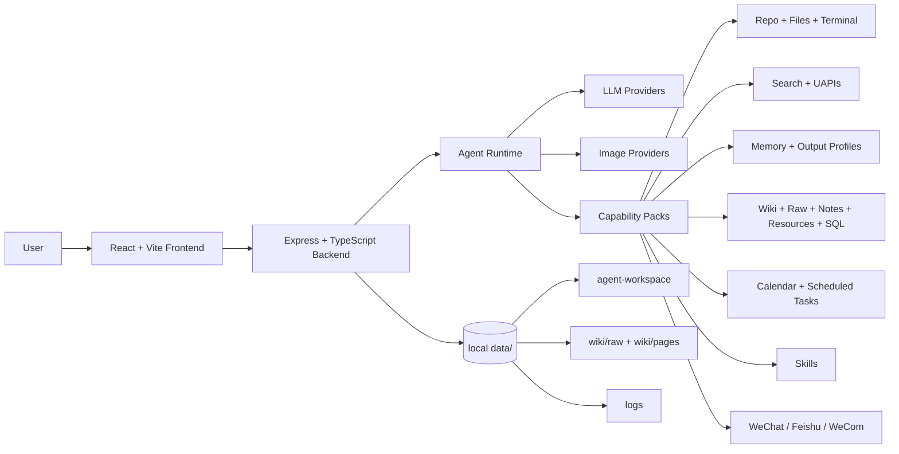

<p align="center">
  <a href="https://github.com/1052666/1052-OS">
    
  </a>
</p>

<h1 align="center">1052 OS</h1>

<p align="center">
  <a href="./README.en.md">English</a>
</p>

<p align="center">
  <strong>本地优先、工具驱动、可接入社交通道的个人 AI 代理工作台</strong>
</p>

<p align="center">
  一个持续迭代中的桌面式 AI 工作系统：把聊天、工具、记忆、知识、任务、搜索、社交通道和本地工作区放进同一套可控环境里。
</p>

<p align="center">
  <a href="https://github.com/1052666/1052-OS/stargazers"></a>
  <a href="https://github.com/1052666/1052-OS/network/members"></a>
  <a href="https://github.com/1052666/1052-OS/graphs/contributors"></a>
  <a href="./LICENSE"></a>
</p>

<p align="center">
  
  
  
  
  
</p>

---

## 加入社区

<table>
  <tr>
    <td width="280" valign="top">
      
    </td>
    <td valign="top">
      <h3>交流、反馈、测试与共建</h3>
      <p><strong>Telegram：</strong><a href="https://t.me/OS1052">https://t.me/OS1052</a></p>
      <p><strong>微信群：</strong>扫描左侧二维码加入内测交流群</p>
      <p><strong>GitHub：</strong><a href="https://github.com/1052666/1052-OS">https://github.com/1052666/1052-OS</a></p>
      <p>欢迎提交 Bug、体验反馈、功能建议、Skill、工具方案与真实使用案例。</p>
    </td>
  </tr>
</table>

---

## 项目状态

1052 OS 当前已经不是单一聊天页，而是一套围绕本地工作流构建的 AI 代理工作台。它把下面这些能力收敛到同一个系统里：

- 聊天式 Agent 与渐进披露工具包
- 本地文件、仓库、终端、SQL 与任务流
- 长期记忆、Wiki、资源库、笔记与输出配方
- 联网搜索、UAPIs 工具箱、Skill 中心
- 日程、定时任务、通知中心
- 微信、飞书、企业微信等社交通道

当前版本的核心目标是：

- 让 Agent 真正接触本地工作区，而不是只在聊天框里回答问题
- 让工具调用、权限、上下文和数据沉淀都可见、可控、可回溯
- 让网页聊天、定时任务、微信、飞书等入口共享同一套 Agent 能力
- 让运行时数据默认保留在本地 `data/` 目录，而不是散落在外部服务里

---

## 项目预览

<table>
  <tr>
    <td width="50%" valign="top">
      
      <br />
      <strong>Chat Workspace</strong>
      <br />
      流式输出、思考折叠、Markdown / Mermaid / 数学公式、上下文压缩、Token 统计、工具执行状态与统一聊天历史。
    </td>
    <td width="50%" valign="top">
      
      <br />
      <strong>Files, Notes, Resources</strong>
      <br />
      本地文件编辑、仓库浏览、笔记目录、资源卡片、Wiki 素材与 Agent 工作区统一管理。
    </td>
  </tr>
  <tr>
    <td width="50%" valign="top">
      
      <br />
      <strong>Search, Skills, Toolbox</strong>
      <br />
      聚合搜索、网页正文读取、UAPIs 工具箱、Skill 市场与按需挂载的能力包。
    </td>
    <td width="50%" valign="top">
      
      <br />
      <strong>Schedules + Social Channels</strong>
      <br />
      日程、定时任务、通知中心，以及微信、飞书、企业微信等外部触达通道。
    </td>
  </tr>
</table>

---

## 核心能力

| 模块 | 当前能力 |
| --- | --- |
| Chat | OpenAI 兼容聊天接口、SSE 流式输出、思考折叠、Markdown 渲染、上下文压缩、Token 统计、统一聊天历史 |
| Agent Runtime | P0 路由、能力包挂载、checkpoint、预算报告、工具进度事件、工具超时保护 |
| LLM 配置 | 多模型预设、任务级路由、Provider 识别、当前默认 `1052 API` 预设 |
| 图像生成 | OpenAI compatible `/images/generations`、Gemini native、Gemini OpenAI compatible |
| 文件系统 | 搜索、读取、新建、替换、插入、复制、移动、删除，适合 Agent 精准维护项目文件 |
| 仓库 | 本地项目识别、README 预览、目录浏览、代码查看、图片预览、仓库打包导出 |
| 终端 | 只读终端与执行型终端分离，支持多 shell、cwd 切换、状态追踪和中断 |
| 笔记 | 真实文件树、Markdown 编辑、预览、搜索、拖拽与目录管理 |
| 资源库 | 标题、正文、备注、标签、状态、链接资源与长文素材的结构化沉淀 |
| 长期记忆 | 普通记忆、敏感记忆、记忆建议、运行时注入与确认机制 |
| 输出配方 | 认知模型、写作风格、素材范围组合成可复用输出方案 |
| Wiki | raw 素材、结构化页面、WikiLink、索引、lint、综合写入与知识沉淀 |
| 搜索 | 聚合搜索、网页正文读取、搜索源管理、联网核实链路 |
| Skill 中心 | 安装、删除、预览、热更新本地 Skill 包 |
| UAPIs 工具箱 | API 目录、接口详情读取、结构化调用、按卡片启用与禁用 |
| 日程与任务 | 普通日程、单次/循环/长期任务、Agent 回调、终端任务、结果回写 |
| 微信桌面通道 | 独立社交通道面板、群聊监听、群级提示词、群权限、群记忆、主动发送 |
| 微信扫码通道 | 扫码登录、重连、文本与媒体消息处理、任务推送 |
| 飞书 / 企业微信 | 基础消息投递、机器人接入、通知联动 |
| 日志与运行数据 | 所有运行时数据落地到本地 `data/`，便于排查与迁移 |

---

## 架构概览



### 前端

- React 18
- Vite 5
- TypeScript
- React Router
- React Markdown
- Mermaid
- KaTeX
- Vitest

### 后端

- Node.js
- Express
- TypeScript
- SSE 流式响应
- OpenAI 兼容聊天与图像接口适配
- Gemini 原生图像接口适配
- Feishu / WeChat / WeCom channel services
- 本地 JSON 数据存储

---

## 从零开始搭建

### 1. 环境要求

建议使用：

- Node.js 20+
- npm 10+
- Git

可运行平台：

- Windows
- macOS
- Linux

可选依赖：

- 一个可用的聊天模型 API Key
- 一个图像生成 API Key
- 飞书、微信、企业微信相关开发配置
- UAPIs API Key

SQL 相关功能额外依赖：

- Python 3.10+
- `uv`

如果你不使用 SQL 查询与编排能力，可以跳过 Python 和 `uv`。

### 2. 克隆仓库

```bash
git clone https://github.com/1052666/1052-OS.git
cd 1052-OS
```

### 3. 安装后端依赖

```bash
cd backend
npm install
```

### 4. 安装前端依赖

```bash
cd ../frontend
npm install
```

### 5. 启动后端

```bash
cd ../backend
npm run dev
```

默认地址：

```text
http://localhost:10053
```

健康检查：

```bash
curl http://localhost:10053/api/health
```

### 6. 启动前端

另开一个终端：

```bash
cd frontend
npm run dev
```

默认地址：

```text
http://localhost:10052
```

### 7. 首次配置 LLM

打开设置页后，至少配置以下项目：

- LLM Base URL
- Model ID
- API Key
- 是否启用流式输出
- 聊天上下文条数
- Agent 权限与渐进披露开关

当前默认预设已经改为：

| 名称 | Base URL | Model ID |
| --- | --- | --- |
| 1052 API | `https://api.lxj.asia/v1` | `deepseek-v4-flash-search` |

获取 API Key：

- `https://api.lxj.asia/register?aff=UOBG`

设置页也内置了常见预设，例如：

- OpenAI
- MiniMax
- Gemini OpenAI
- DeepSeek
- Moonshot
- OpenRouter
- SiliconFlow
- 智谱

### 8. 配置图像生成

图像生成支持三类接口：

| API 格式 | Base URL 示例 | 说明 |
| --- | --- | --- |
| OpenAI compatible | `https://api.openai.com/v1` | 自动拼接 `/images/generations` |
| Gemini native | `https://generativelanguage.googleapis.com/v1beta` | 自动拼接 `generateContent` |
| Gemini OpenAI compatible | `https://generativelanguage.googleapis.com/v1beta/openai` | 使用 Gemini 的 OpenAI 兼容图像接口 |

生成后的图片会保存到：

```text
data/generated-images/
```

---

## 微信桌面通道

当前版本已经包含独立的微信桌面通道面板，和旧的扫码微信入口明确分离。

主要能力：

- 指定群聊窗口绑定
- 独立启停监听
- 群级别权限开关
- 群级提示词追加
- 群级记忆读写
- 群聊中 `@机器人` 触发 Agent
- Agent 从其他通道主动调用桌面微信发消息

当前监听策略：

- 启动后立即检查
- 约 `1 秒` 轮询一次
- `1.5 秒` 批次合并窗口
- 保持聊天列表停留在底部
- 约 `25 秒` 轻量聚焦一次绑定窗口

说明：

- 桌面微信自动化目前只在 Windows 环境下可用
- 相关 Python 桥接与 `pywechat` 方案已内置在项目 `vendor/` 中

---

## 数据目录

运行时数据统一存放在项目根目录的 `data/` 下。首次运行会自动创建。

常见结构：

```text
data/
|-- agent-workspace/
|-- channels/
|-- generated-images/
|-- logs/
|-- memory/
|-- notes/
|-- resources/
|-- skills/
|-- wiki/
|   |-- raw/
|   `-- wiki/
|-- chat-history.json
`-- settings.json
```

通常不应提交到 GitHub 的内容：

- `data/`
- `node_modules/`
- `dist/`
- `.env`
- 本地日志
- 模型密钥
- 渠道登录态
- 聊天历史

---

## Agent 的工作方式

1052 OS 的 Agent 不是单纯把用户消息转发给模型。它会根据权限、任务、上下文预算和能力包状态动态组织运行链路：

1. 用户从网页、微信、飞书或定时任务入口发起请求
2. 后端注入系统提示词、运行时状态、权限模式、记忆、输出配方与上下文摘要
3. P0 层先判断当前任务是否需要挂载额外能力包
4. 按需挂载 `repo-pack`、`search-pack`、`memory-pack`、`data-pack`、`plan-pack`、`skill-pack`、`channel-pack`
5. 执行工具调用，并把结果回流给模型继续推理
6. 最终结果回写到聊天流、通知中心或外部社交通道

这套设计适合处理真正的工作任务，例如：

- 阅读仓库并总结启动方式
- 改本地文件的某几行配置
- 把资料整理到资源库或 Wiki
- 在定时任务里触发 Agent 或终端命令
- 从网页端让模型主动发微信
- 在群聊里基于群级记忆和提示词处理消息

---

## 权限模型

1052 OS 默认采用保守权限：

- 读取、搜索、预览、状态检查通常可直接执行
- 写入、删除、覆盖、安装、外部发送、执行命令等操作在非完全权限模式下需要明确确认
- 用户可以在设置页开启“完全权限”
- 长期记忆与敏感信息分层管理，避免密钥或登录态泄露到普通上下文里

---

## 搜索、Skill 与工具箱

### 搜索

项目支持：

- 聚合搜索
- 网页正文读取
- 搜索源管理
- UAPIs 搜索类接口交叉验证

原则上，凡是会变化的信息都应该联网核实，例如：

- 新闻
- 价格
- 产品规格
- API 文档
- 平台规则
- 人物/职位变化

### Skill 中心

Skill 可以理解为可安装的能力包，通常由以下文件组成：

- `SKILL.md`
- 脚本
- 模板
- 参考资料
- 辅助资源

项目支持：

- 查看已安装 Skill
- 搜索 Skill 市场
- 安装 / 删除 Skill
- 预览 Skill 文档

### UAPIs 工具箱

UAPIs 工具箱把接口目录做成可视化卡片，Agent 不会一次性吃下全部接口说明，而是先读取轻量索引，再按需展开具体 API。

推荐调用顺序：

1. `uapis_list_apis`
2. `uapis_read_api`
3. `uapis_call`

---

## 本地开发命令

后端：

```bash
cd backend
npm run build
npm test
npm run dev
```

前端：

```bash
cd frontend
npm run build
npm test
npm run dev
```

默认端口：

```text
Frontend: http://localhost:10052
Backend:  http://localhost:10053
```

---

## 目录结构

```text
1052-OS/
|-- assets/
|   `-- readme/
|-- backend/
|   |-- prompts/
|   |-- scripts/
|   `-- src/
|       |-- modules/
|       |-- app.ts
|       `-- index.ts
|-- docs/
|-- frontend/
|   `-- src/
|       |-- api/
|       |-- components/
|       |-- pages/
|       `-- styles.css
|-- vendor/
|-- LICENSE
|-- README.md
`-- README.en.md
```

运行后会自动生成：

```text
data/
```

---

## 贡献者

感谢所有参与测试、反馈、设计、代码提交和功能共建的贡献者。

<p>
  <a href="https://github.com/1052666/1052-OS/graphs/contributors">
    
  </a>
</p>

贡献者列表会随着 GitHub 自动更新。如果你的贡献没有正确显示，通常是因为提交邮箱还没有绑定到 GitHub 账号。

---

## Stars 与增长

<p align="center">
  <a href="https://star-history.com/#1052666/1052-OS&Date">
    
  </a>
</p>

---

## 常见问题

### 1. 没有 API Key 可以启动吗？

可以启动前后端和大部分本地面板，但 Agent 聊天至少需要配置一个可用的 LLM API Key。

### 2. 默认模型现在是什么？

当前默认预设是：

- `1052 API`
- Base URL: `https://api.lxj.asia/v1`
- Model ID: `deepseek-v4-flash-search`

### 3. `data/` 目录需要提交吗？

不需要。`data/` 是运行时目录，包含设置、日志、聊天历史、记忆、资源、Skill、Wiki、渠道状态等本地数据。

### 4. 桌面微信通道支持哪些平台？

桌面微信自动化通道目前以 Windows 为主，其它平台可以继续使用网页面板、飞书、扫码微信等能力。

### 5. 前后端默认端口是多少？

- 前端：`10052`
- 后端：`10053`

---

## License

This project is licensed under the [MIT License](./LICENSE).
