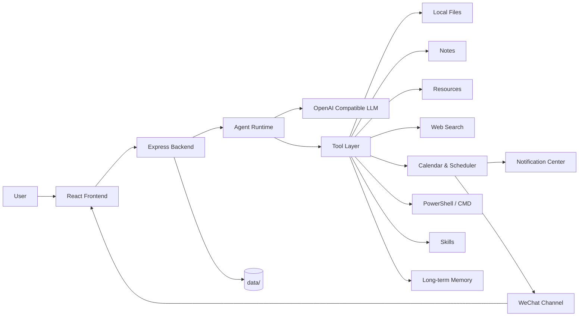

<p align="center">
  <a href="https://github.com/1052666/1052-OS">
    
  </a>
</p>

<p align="center">
  <a href="https://github.com/1052666/1052-OS"></a>
  
  
  
  
  
</p>

<p align="center">
  1052 OS 是一个本地优先的 AI Agent 工作台，围绕聊天、文件、笔记、资源、Skill、搜索、定时任务、通知和社交通道构建。
</p>

<p align="center">
  项目地址：<a href="https://github.com/1052666/1052-OS">https://github.com/1052666/1052-OS</a>
</p>

<p align="center">
  <a href="#项目预览"></a>
  <a href="#功能概览"></a>
  <a href="#快速开始"></a>
</p>

> 这是一个面向真实工作流的个人 Agent 系统，而不是只会聊天的页面。项目由一名 17 岁学生开发者独立设计、开发和持续迭代，目标是把模型、工具、文件、记忆、搜索、定时任务和社交通道真正组合成可长期使用的本地工作区。

---

## 项目预览

<table>
  <tr>
    <td width="50%" valign="top">
      
      <br />
      <strong>聊天工作台</strong>
      <br />
      SSE 流式输出、思考过程折叠、Markdown 渲染、Token 统计、上下文压缩，都围绕连续对话体验展开。
    </td>
    <td width="50%" valign="top">
      
      <br />
      <strong>文件与资源管理</strong>
      <br />
      Agent 能读写本地文件、按行修改代码、维护资源库、操作笔记目录，也有独立工作区用于生成临时文件和报告。
    </td>
  </tr>
  <tr>
    <td width="50%" valign="top">
      
      <br />
      <strong>搜索与 Skill 中心</strong>
      <br />
      聚合搜索源、搜索状态面板、Skill 市场预览与安装能力，强调可扩展和交叉验证，而不是单一结果。
    </td>
    <td width="50%" valign="top">
      
      <br />
      <strong>定时任务与社交通道</strong>
      <br />
      支持日程、循环任务、Agent 回调、通知中心和微信通道，把任务触发结果真正送回用户。
    </td>
  </tr>
</table>

---

## 关于项目

1052 OS 是一个面向个人工作流的 AI Agent 操作台。它不是单纯的聊天页面，而是把模型、工具、文件系统、笔记、资源库、定时任务和社交通道组合到同一个本地工作区里，让 AI 可以真正帮用户完成任务。

这个项目由一名 17 岁学生开发者独立设计、开发和持续打磨。它的目标不是做一个华丽但空洞的 Demo，而是做一个可以每天使用、可以不断扩展、可以让 AI 接触真实工作流的个人系统。

核心理念：

- 本地优先：聊天记录、资源、笔记配置、Skill、日志和运行时数据默认保存在本机 `data/` 目录。
- 工具驱动：Agent 不只回答问题，还可以调用文件、搜索、日历、终端、资源、记忆、Skill 等工具。
- 用户可控：高风险写入和执行操作默认需要确认；用户也可以在设置里开启完全权限。
- 可持续扩展：Skill 中心、社交通道、搜索源、定时任务和本地工具都按模块设计。
- 面向真实使用：支持长任务、流式输出、上下文压缩、微信回显、通知中心、定时提醒和本地文件管理。

---

## 功能概览

| 模块 | 能力 |
| --- | --- |
| AI 聊天 | OpenAI 兼容接口、流式输出、思考过程折叠、token 统计、上下文压缩、Markdown 渲染 |
| Agent 工具 | 文件增删查改、按行编辑、仓库读取、笔记管理、资源管理、联网搜索、终端执行、图像生成 |
| 仓库工作区 | 自动识别本地项目，读取 README、文件树和项目说明，聊天内支持快速跳转 |
| 笔记系统 | 支持绑定本地笔记目录，也可以自动创建 `data/notes/` 作为默认笔记目录 |
| 资源列表 | 保存网址、长文本、清单、备注和标签，按条目拆分保存，便于维护和删除 |
| Skill 中心 | 本地 Skill 管理、市场搜索、预览、安装和热更新 |
| 搜索系统 | 聚合搜索源、新闻搜索、网页读取、搜索源状态可视化 |
| 日历和定时任务 | 普通日程、单次任务、循环任务、长期任务、Agent 回调、终端任务、微信推送 |
| 通知中心 | 未读提醒、任务结果回写、按任务跳回聊天上下文 |
| 社交通道 | 当前支持微信扫码接入、消息回显、媒体收发、定时任务推送 |
| 长期记忆 | 普通长期记忆、敏感长期记忆、记忆建议、运行时注入预览 |
| 图像生成 | OpenAI 格式图像生成配置，生成结果可在聊天中展示 |
| 设置面板 | 模型配置、主题、完全权限、图像生成、token 可视化统计 |

---

## 技术栈

### 前端

- Vite
- React 18
- TypeScript
- React Router
- React Markdown
- Mermaid
- KaTeX
- 自定义主题系统和虚拟列表优化

### 后端

- Node.js
- Express
- TypeScript
- OpenAI compatible Chat Completions
- Server-Sent Events
- 本地 JSON 文件存储
- 模块化工具执行层

### 默认端口

| 服务 | 端口 |
| --- | --- |
| 前端 Vite | `10052` |
| 后端 Express | `10053` |

---

## 架构示意



---

## 目录结构

```text
1052-OS/
|-- README.md
|-- AGENTS.md
|-- assets/
|   `-- readme/
|       |-- hero.svg
|       |-- preview-chat.svg
|       |-- preview-files.svg
|       |-- preview-search.svg
|       `-- preview-schedule.svg
|-- backend/
|   |-- package.json
|   |-- prompts/
|   |   |-- agent-system.md
|   |   `-- agent-system-minimax.md
|   `-- src/
|       |-- app.ts
|       |-- config.ts
|       |-- modules/
|       `-- storage.ts
|-- frontend/
|   |-- package.json
|   |-- vite.config.ts
|   `-- src/
|       |-- api/
|       |-- components/
|       |-- pages/
|       `-- styles.css
`-- data/
    `-- created automatically at runtime, not committed to Git
```

`data/` 是运行时目录，包含聊天记录、模型设置、日志、微信凭据、生成图片、Skill、笔记配置、资源条目和长期记忆等。这个目录不会发布到 GitHub，首次运行时后端会自动创建。

---

## 快速开始

### 1. 克隆项目

```bash
git clone https://github.com/1052666/1052-OS.git
cd 1052-OS
```

### 2. 安装依赖

```bash
cd backend
npm install

cd ../frontend
npm install
```

### 3. 启动后端

```bash
cd backend
npm run dev
```

后端默认运行在：

```text
http://localhost:10053
```

健康检查：

```bash
curl http://localhost:10053/api/health
```

Windows PowerShell：

```powershell
Invoke-RestMethod http://localhost:10053/api/health
```

### 4. 启动前端

```bash
cd frontend
npm run dev
```

前端默认运行在：

```text
http://localhost:10052
```

### 5. 配置模型

打开前端设置页面，填写 OpenAI 兼容接口配置：

- Base URL
- Model ID
- API Key
- 是否启用流式输出
- 是否开启完全权限
- 图像生成配置

模型配置会保存到本地 `data/settings.json`，不会提交到 GitHub。

---

## 构建检查

后端：

```bash
cd backend
npm run build
```

前端：

```bash
cd frontend
npm run build
```

前端构建产物位于 `frontend/dist/`，该目录不会提交到仓库。

---

## Agent 能力细节

### 聊天和上下文

- 支持真实 SSE 流式输出。
- 支持 `<think>...</think>` 思考过程折叠展示。
- 支持 Markdown、表格、任务列表、代码块、数学公式、Mermaid 图表和安全 HTML。
- 支持 `/new` 清空上下文。
- 支持 `/compact` 自动压缩上下文，并备份旧聊天记录。
- 每次回复后展示 token 使用统计。

### 文件工具

Agent 可以在权限允许时管理本地文件：

- `filesystem_stat_path`
- `filesystem_list_directory`
- `filesystem_search_files`
- `filesystem_search_content`
- `filesystem_read_file`
- `filesystem_create_directory`
- `filesystem_create_file`
- `filesystem_write_file`
- `filesystem_replace_in_file`
- `filesystem_replace_lines`
- `filesystem_insert_lines`
- `filesystem_move_path`
- `filesystem_copy_path`
- `filesystem_delete_path`

其中 `filesystem_replace_lines` 和 `filesystem_insert_lines` 用于精准行号编辑。当用户要求“修改第 20 行”“删除第 30 到 35 行”“在第 10 行后插入内容”时，Agent 会优先使用这些按行工具，而不是强行构造字符串替换。

### 资源列表

资源列表适合保存不规则资料，例如：

- 一个网址加说明
- 一段长文本
- 一组待整理清单
- 某个兑换码或临时资料
- 需要后续让 Agent 整理的信息

资源按条目拆分保存到：

```text
data/resources/items/<resource-id>.json
```

每条资源支持：

- title
- content
- note
- tags
- status

### 长期记忆

长期记忆分为两层：

- 普通长期记忆：保存偏好、规则、工作流和项目上下文。
- 敏感长期记忆：保存 API Key、令牌、密码等敏感内容的目录和受控原文。

敏感内容不会默认注入到模型上下文。只有在任务确实需要时，Agent 才会按条目读取。

### Skill 系统

Skill 是 Agent 的热更新能力包，默认存放在：

```text
data/skills/<skill-id>/SKILL.md
```

一个 Skill 可以包含：

- `SKILL.md`
- `references/`
- `scripts/`
- `assets/`

Skill 中心支持查看、搜索、安装、预览和删除 Skill。

---

## 社交通道

当前主要支持微信通道：

- 前端提供独立微信二级页面。
- 支持扫码登录微信。
- 支持文本消息收发。
- 支持图片、文件、语音、视频等媒体接收。
- 支持 Agent 回复中的本地图片和文件链接自动转为微信媒体发送。
- 支持统一聊天流回显。
- 支持定时任务结果推送到最近微信会话或固定会话。

微信相关凭据保存在：

```text
data/channels/wechat/
```

这个目录包含个人账号状态和上下文 token，禁止提交到 GitHub。

---

## 定时任务

1052 OS 的日历分为两类：

- 普通日常安排：用于展示和查询。
- 定时任务：用于自动触发 Agent 或终端命令。

定时任务支持：

- 单次任务
- 循环任务
- 长期任务
- Agent 回调
- 终端命令
- 聊天流回写
- 通知中心提醒
- 微信推送

例如，你可以让 Agent 创建这样的任务：

```text
每天早上 8 点联网搜索最近 24 小时的 AI 新闻，整理成中文摘要，附上来源链接，然后推送给我。
```

到点后，Agent 会收到预设 prompt，调用联网搜索工具，整理结果，并把结果写回聊天流、通知中心或微信通道。

---

## 数据和隐私

本项目默认本地优先，运行时数据都放在 `data/`：

```text
data/
|-- agent-workspace/
|-- chat-history.json
|-- channels/
|-- generated-images/
|-- logs/
|-- memory/
|-- notes/
|-- resources/
|-- settings.json
`-- skills/
```

发布到 GitHub 前请确认：

- 不提交 `data/`
- 不提交 `node_modules/`
- 不提交 `dist/`
- 不提交 `.env`
- 不提交日志文件
- 不提交微信账号文件
- 不提交 API Key、token、密码或其他私密信息

本仓库的 `.gitignore` 已经默认排除这些内容。

---

## 完全权限模式

默认情况下，Agent 执行高风险写入或终端操作前，需要先告诉用户即将做什么并等待确认。

如果在设置页面开启“完全权限”，Agent 会获得更高执行权限，例如：

- 写入或删除本地文件
- 修改笔记
- 管理资源
- 安装或删除 Skill
- 执行终端命令
- 写入长期记忆

请只在你信任当前任务和当前模型配置时开启完全权限。

---

## API 概览

基础接口：

- `GET /api/health`
- `GET /api/settings`
- `PUT /api/settings`
- `POST /api/agent/chat`
- `POST /api/agent/chat/stream`
- `GET /api/agent/history`
- `GET /api/agent/history/events`

核心模块：

- `/api/calendar`
- `/api/notifications`
- `/api/repositories`
- `/api/notes`
- `/api/resources`
- `/api/skills`
- `/api/memory`
- `/api/websearch`
- `/api/images`
- `/api/channels/wechat`

---

## 适合谁使用

1052 OS 适合这些场景：

- 想要一个本地优先的个人 AI 工作台。
- 想让 AI 管理本地笔记、资源和项目。
- 想把 AI 接入微信等社交通道。
- 想用定时任务让 AI 自动搜索、总结、提醒和推送。
- 想研究 Agent 工具调用、Skill 设计、长期记忆和本地文件操作。
- 想基于 OpenAI 兼容接口构建自己的桌面级 AI 工作流。

---

## Roadmap

- 多会话管理。
- 更细粒度的聊天中止和任务取消。
- 更多社交通道接入。
- 笔记 RAG 检索增强。
- 更完整的 Skill 市场体验。
- 更丰富的搜索源和交叉验证策略。
- 更细致的权限审计和操作记录。
- 更完整的移动端适配。

---

## 贡献

欢迎提交 Issue、建议和 Pull Request。

如果你想参与开发，可以优先关注：

- 前端性能优化。
- Agent 工具稳定性。
- Skill 生态。
- 搜索源适配。
- 社交通道扩展。
- README、文档和示例补充。

---

## 作者的话

1052 OS 是一个由 17 岁学生开发者做出来的长期项目。它还在快速迭代，但已经具备完整的本地 Agent 工作台雏形。

如果你觉得这个项目有意思，欢迎 Star、Fork 或提出建议。这个项目会继续朝着“真正能帮人做事的个人 AI 操作系统”这个方向打磨下去。

---

## License

This project is licensed under the MIT License.
