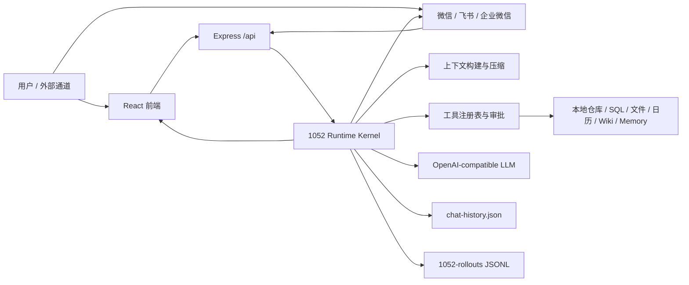
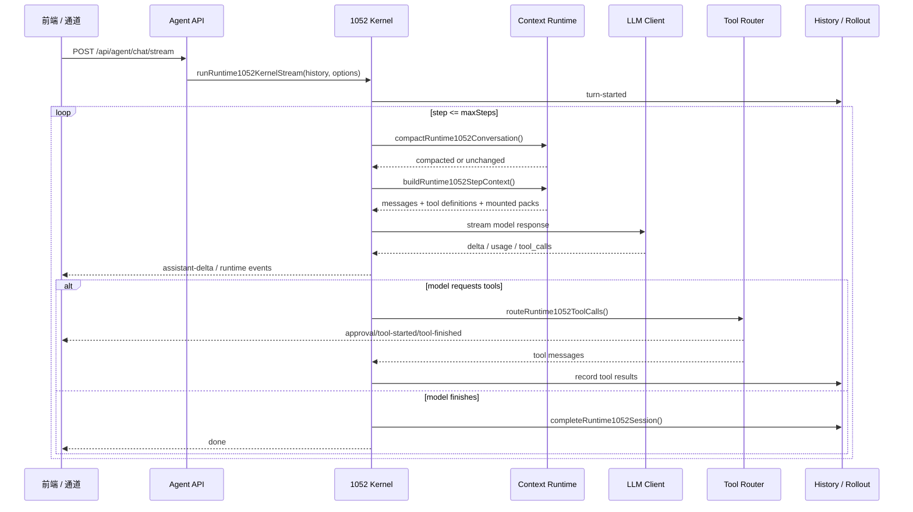
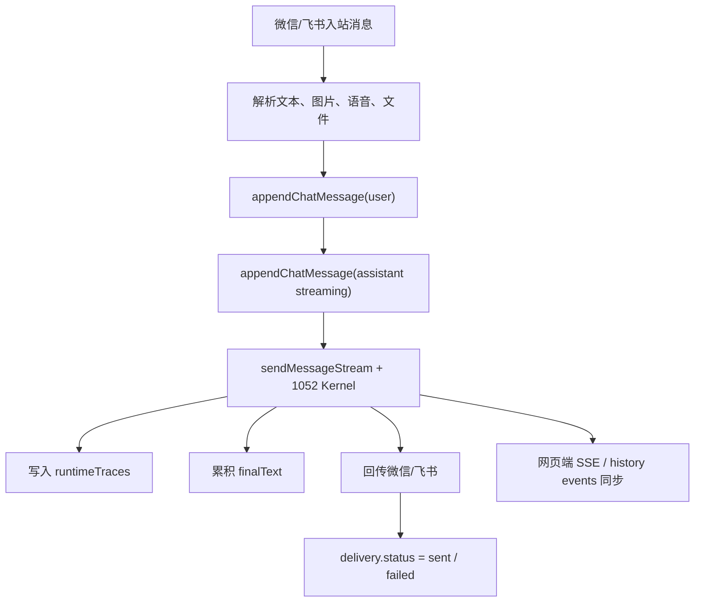

# 1052 OS

1052 OS 是一个本地优先的个人 AI 操作系统。它把对话、工具调用、长期记忆、知识库、自动化任务、本地仓库、SQL 工作台和微信/飞书等外部通道放进同一套可观察、可审批、可恢复的运行时里。

当前版本已经完成一轮前端重写：旧前端页面、旧 Mirror 视觉层和巨型全局样式被废弃，新的首页是「今日控制台」，核心体验围绕 Agent 对话、Runtime Loop、工具审批和运行检查器展开。

<p align="center">
  
</p>

<p align="center">
  <a href="https://github.com/1052666/1052-OS"></a>
  
  
  
</p>

## 目录

- [核心能力](#核心能力)
- [界面预览](#界面预览)
- [技术栈](#技术栈)
- [项目结构](#项目结构)
- [快速启动](#快速启动)
- [配置与数据目录](#配置与数据目录)
- [系统架构](#系统架构)
- [Runtime Loop 技术流程](#runtime-loop-技术流程)
- [上下文压缩机制](#上下文压缩机制)
- [工具系统与审批](#工具系统与审批)
- [外部通道闭环](#外部通道闭环)
- [前端架构](#前端架构)
- [后端 API 模块](#后端-api-模块)
- [测试与验证](#测试与验证)
- [开发约定](#开发约定)

## 核心能力

### 今日控制台

- 聚合日程、定时任务、通知、近期记忆、运行状态和快捷输入。
- 支持从首页直接发起 Agent 对话。
- 单个模块请求失败时局部降级，不拖垮整个首页。

### Agent 对话

- 对话内容是主体，运行细节以「运行轨迹」折叠展示。
- 工具调用、审批、上下文升级、压缩、错误和完成状态都进入 Runtime Trace。
- 用户消息采用轻量文本布局，Agent 回复支持 Markdown、代码块、表格、数学公式和附件。
- 长对话提供一键回到底部按钮，阅读历史和跟随最新消息互不干扰。

### 工作区

- 本地仓库索引、文件查看、仓库描述。
- SQL 数据源、SQL 文件、变量、SSH 服务器、Shell 文件和查询工作台。
- 编排任务可以连接 SQL、Shell、等待、调试等节点。

### 知识系统

- Notes、Wiki、PKM、资源库、长期记忆、敏感长期记忆和输出配置。
- Wiki 用于源材料和结构化知识，Memory 用于用户偏好、长期事实和可复用上下文。
- 输出配置用于定义 Agent 在特定场景下的表达方式、认知模型和素材范围。

### 自动化

- 日历事件与定时任务。
- 执行记录、通知中心和任务结果回写。
- 流程编排支持可视化编辑，复杂编辑器按路由懒加载。

### 能力与连接

- Skills、UAPIs、搜索源、工具箱。
- 微信官方 Bot 通道、飞书事件/卡片通道、企业微信 Webhook。
- 外部通道与网页端共享同一套 Agent Runtime，而不是各自维护独立机器人逻辑。

## 界面预览

| 今日控制台 | Agent 对话 |
| --- | --- |
|  |  |

| 工作区 | 自动化 |
| --- | --- |
|  |  |

## 技术栈

### 前端

- React 18 + Vite + TypeScript strict mode
- React Router
- TanStack Query
- Zustand
- Zod
- Radix UI
- Lucide React
- Motion
- React Hook Form
- CodeMirror
- TanStack Table / Virtual
- React Flow
- Mermaid / KaTeX / Markdown 渲染

### 后端

- Node.js + Express + TypeScript ESM
- Zod 契约校验
- better-sqlite3
- MySQL / SSH2
- SSE 流式事件
- 本地 JSON 文件存储
- 微信、飞书、企业微信通道模块

## 项目结构

```text
.
├── backend/                    # Express API、Agent Runtime、工具和通道
│   ├── prompts/                # Agent 系统提示词
│   └── src/
│       ├── modules/agent/      # 1052 Runtime、上下文、工具、审批、历史
│       ├── modules/channels/   # 微信、飞书、企业微信
│       ├── modules/settings/   # 模型、Agent、外观等设置
│       ├── modules/sql/        # SQL 数据源、查询、变量、Shell
│       ├── modules/wiki/       # Wiki 知识库
│       ├── modules/memory/     # 长期记忆
│       └── app.ts              # API 路由装配
├── frontend/                   # 新版前端
│   └── src/
│       ├── app/                # 路由、导航、QueryClient
│       ├── components/         # Shell、Chat、UI primitives
│       ├── contracts/          # Zod API 契约
│       ├── data/               # ApiClient
│       ├── features/           # 工作区、知识、自动化、能力
│       ├── pages/              # today/chat/workspace/knowledge/...
│       ├── runtime/            # SSE reducer 与 Runtime Trace
│       ├── state/              # Zustand 状态
│       └── styles/             # 设计令牌、基础样式、主题
├── docs/                       # 设计说明与运行时文档
├── assets/readme/              # README 截图资源
└── data/                       # 本地运行数据，默认不提交
```

## 快速启动

### 环境要求

- Node.js 20+
- npm
- Windows、macOS 或 Linux
- 可访问 OpenAI-compatible LLM 服务，或配置本地模型代理

### 安装依赖

```bash
cd backend
npm install

cd ../frontend
npm install
```

### 启动后端

```bash
cd backend
npm run dev
```

默认监听：

```text
http://localhost:10053
```

健康检查：

```bash
curl http://localhost:10053/api/health
```

### 启动前端

```bash
cd frontend
npm run dev
```

默认访问：

```text
http://localhost:10052
```

前端 Vite 代理会把 `/api/*` 转发到 `http://localhost:10053`。如果后端地址不同，可以设置：

```bash
BACKEND_URL=http://localhost:10053 npm run dev
```

PowerShell 示例：

```powershell
$env:BACKEND_URL="http://localhost:10053"
npm run dev
```

## 配置与数据目录

后端默认把用户数据写入仓库根目录下的 `data/`，该目录已被 `.gitignore` 排除。

常见文件：

| 路径 | 说明 |
| --- | --- |
| `data/settings.json` | 模型、Agent、外观、通道等设置 |
| `data/chat-history.json` | 当前对话历史 |
| `data/chat-history-backups/` | `/new` 和压缩历史产生的备份 |
| `data/1052-rollouts/` | 1052 Runtime 每轮运行事件 |
| `data/research/research-sessions.sqlite` | 多轮研究会话、结果状态和查询来源 |
| `data/logs/` | 后端运行日志 |
| `data/channels/wechat/` | 微信通道账号、媒体和状态 |
| `data/channels/feishu/` | 飞书通道配置、媒体和状态 |
| `data/generated-images/` | 生成图片静态资源 |

可以通过环境变量改写数据目录：

```bash
DATA_DIR=/absolute/path/to/data npm run dev
```

端口通过 `PORT` 改写：

```bash
PORT=10053 npm run dev
```

## 系统架构


```mermaid
flowchart LR
  User["用户 / 外部通道"] --> Frontend["React 前端"]
  User --> Channels["微信 / 飞书 / 企业微信"]
  Frontend --> Api["Express /api"]
  Channels --> Api
  Api --> Runtime["1052 Runtime Kernel"]
  Runtime --> Context["上下文构建与压缩"]
  Runtime --> Tools["工具注册表与审批"]
  Runtime --> LLM["OpenAI-compatible LLM"]
  Tools --> Local["本地仓库 / SQL / 文件 / 日历 / Wiki / Memory"]
  Runtime --> History["chat-history.json"]
  Runtime --> Rollout["1052-rollouts JSONL"]
  Runtime --> Frontend
  Runtime --> Channels
```

核心原则：

- 网页端、微信、飞书和定时任务共享同一个 Agent Runtime。
- 工具调用不是隐藏动作，而是 Runtime 事件，可展示、可审批、可记录。
- 对话历史、设置、记忆和文件默认保留在本地 `data/`。
- 通道层不设置固定 10 分钟任务超时，任务生命周期由 Runtime、用户取消、模型流完成或具体工具自己的局部超时控制。

## Runtime Loop 技术流程

1052 Runtime 位于 `backend/src/modules/agent/1052-kernel.ts`，它负责把一次用户输入推进为完整的 Agent 回合。


```mermaid
sequenceDiagram
  participant UI as 前端 / 通道
  participant API as Agent API
  participant K as 1052 Kernel
  participant C as Context Runtime
  participant L as LLM Client
  participant T as Tool Router
  participant H as History / Rollout

  UI->>API: POST /api/agent/chat/stream
  API->>K: runRuntime1052KernelStream(history, options)
  K->>H: turn-started
  loop step <= maxSteps
    K->>C: compactRuntime1052Conversation()
    C-->>K: compacted or unchanged
    K->>C: buildRuntime1052StepContext()
    C-->>K: messages + tool definitions + mounted packs
    K->>L: stream model response
    L-->>K: delta / usage / tool_calls
    K-->>UI: assistant-delta / runtime events
    alt model requests tools
      K->>T: routeRuntime1052ToolCalls()
      T-->>UI: approval/tool-started/tool-finished
      T-->>K: tool messages
      K->>H: record tool results
    else model finishes
      K->>H: completeRuntime1052Session()
      K-->>UI: done
    end
  end
```

关键事件：

| RuntimeEvent | 含义 |
| --- | --- |
| `turn-started` | 新回合开始 |
| `step-started` | 新模型 step 开始，包含工具包、上下文预算 |
| `assistant-delta` | 模型流式输出文本 |
| `model-response` | 模型完成一次采样，可能包含工具调用 |
| `tool-call-started` | 工具开始执行 |
| `tool-call-finished` | 工具完成或失败 |
| `approval-requested` | 需要用户审批 |
| `context-upgrade-*` | 上下文包升级 |
| `conversation-compacted` | 对话上下文已压缩 |
| `usage-recorded` | Token 使用量记录 |
| `turn-aborted` | 回合被取消或模型流异常 |

前端的 `frontend/src/runtime/runtime.ts` 会把 SSE 事件归一化为可展示的 Runtime Trace，对话页再把这些轨迹折叠在 Agent 回复下方。

## 上下文压缩机制

1052 OS 的压缩不是简单删消息，而是面向长任务续跑的 checkpoint。

实现文件：

- `backend/src/modules/agent/1052-context-policy.ts`
- `backend/src/modules/agent/1052-compaction-runtime.ts`
- `backend/src/modules/agent/1052-context-runtime.ts`
- `docs/1052-runtime-context-compaction.md`

流程：

1. Runtime 在每个 step 前估算当前会话 token。
2. 达到自动压缩线后，生成 continuation summary。
3. 新上下文由「最近真实用户消息」和「压缩摘要消息」组成。
4. Runtime 发出 `conversation-compacted` 事件，前端显示为运行轨迹。
5. 如果摘要模型失败，系统保留最近尾部窗口并标记 fallback，不中断用户任务。

默认策略：

| 项目 | 默认值 | 说明 |
| --- | ---: | --- |
| 活动消息窗口 | 160 条 | 每轮最多带入近期有效消息 |
| 自动压缩线 | 80,000 tokens | 达到后触发摘要压缩 |
| 用户消息保留预算 | 8,000 tokens | 压缩后优先保留真实用户意图 |
| 摘要分块大小 | 32,000 字符 | 超长 transcript 分块摘要 |
| 兜底尾部窗口 | 60 条 | 摘要失败时保留最近消息 |

旧设置里的「上下文消息上限」和「自动压缩阈值」仍可被后端读取，但新版设置页不再把这些数字暴露给普通用户，运行时使用自动策略。

## 工具系统与审批

工具由 `backend/src/modules/agent/1052-tool-registry.ts` 统一注册，再由 `1052-tool-router.ts` 路由执行。

工具元数据包括：

- 工具名
- 读/写安全分类
- 是否有副作用
- 是否需要确认
- 是否支持并行
- 是否有工具自身局部超时

权限模型：

| 模式 | 行为 |
| --- | --- |
| 默认模式 | 读操作可直接执行，写入、删除、终端、SQL 写入、外部消息等需要审批 |
| full access | 用户显式开启后，允许自动确认副作用工具 |
| read-only | 阻止副作用工具 |

设计要点：

- 全局工具执行不再设置固定 25 分钟 `Promise.race` 超时。
- `claude_code` 不再由 1052 OS 在 10 分钟后强杀，等待 CLI 自身结束。
- 终端命令、网络请求、扫码登录、审批等待仍保留各自必要的局部超时。
- 工具输出会被包成 `{ ok, data }` 或 `{ ok: false, error }` 后回填模型上下文。
- 超长工具输出会截断并附带 `_hint`，让模型收窄下一次查询。

## 多轮研究会话

复杂对比、跨来源核验和研究报告不再依赖一次性的 `websearch_search`。`search-pack`
提供持久化研究会话，网页、微信、飞书和定时任务可以通过同一个 `sessionId`
继续同一项研究：

| 工具 | 作用 |
| --- | --- |
| `websearch_research_start` | 创建研究主题和持久化 Session |
| `websearch_research_search` | 在 Session 中执行一轮搜索并累积来源 |
| `websearch_research_status` | 查看轮次、RRF 排名和待审/批准/拒绝结果 |
| `websearch_research_review` | 审核结果，必要时恢复为待审，并可完成 Session |

研究结果默认进入 `pending`，不会直接被当成已验证证据。URL 会先规范化并去除常见
跟踪参数，重复来源只保留一个结果节点；同一来源在多个查询轮次中出现时，使用
Reciprocal Rank Fusion 累积排序，同时保留每轮查询、名次和原始分数。

状态保存在 `data/research/research-sessions.sqlite`。SQLite 使用 WAL、外键和事务，
避免网页、外部通道和定时任务并发追加时发生 JSON 覆盖。研究会话属于可恢复的
Agent 工作状态，不修改聊天历史、长期记忆、Wiki 或 PKM；后续证据与知识沉淀只消费
明确批准的结果。

## 外部通道闭环

微信和飞书不是独立机器人，它们把外部消息转为同一套 Chat History 和 Runtime 流。


```mermaid
flowchart TD
  Inbound["微信/飞书入站消息"] --> Normalize["解析文本、图片、语音、文件"]
  Normalize --> UserMsg["appendChatMessage(user)"]
  UserMsg --> AssistantMsg["appendChatMessage(assistant streaming)"]
  AssistantMsg --> Runtime["sendMessageStream + 1052 Kernel"]
  Runtime --> Trace["写入 runtimeTraces"]
  Runtime --> Partial["累积 finalText"]
  Runtime --> SendBack["回传微信/飞书"]
  SendBack --> Delivery["delivery.status = sent / failed"]
  Runtime --> Web["网页端 SSE / history events 同步"]
```

通道策略：

- 入站消息写入 `data/chat-history.json`，网页端会通过 history events 同步。
- 工具调用、审批和压缩事件会进入消息 `meta.runtimeTraces`。
- 如果模型流末尾中断但已经生成了正文，通道会先回传已生成内容，并把网页端状态标记为已回传而不是运行失败。
- 通道层不再有 10 分钟整轮超时，长任务由 Runtime 和具体工具控制。
- Markdown 整文档代码围栏会在外部通道发送前解包，避免微信/飞书收到一整段 ```markdown 包裹。

## 前端架构

新版前端位于 `frontend/src`，不复用旧 `frontend/src/api`、旧页面、旧 Mirror 主题和旧巨型 CSS。

路由：

| 路径 | 页面 |
| --- | --- |
| `/today` | 今日控制台 |
| `/chat` | Agent 对话 |
| `/workspace/*` | 本地仓库、SQL、数据源、Shell |
| `/knowledge/*` | Notes、Wiki、Memory、PKM、资源、输出配置 |
| `/automations/*` | 日历、定时任务、编排、执行记录 |
| `/capabilities/*` | Skills、工具箱、搜索源、外部通道 |
| `/settings/*` | 模型、Agent 权限、外观、系统维护 |

实现约定：

- `contracts/schemas.ts` 定义 Zod 请求/响应契约。
- `data/api.ts` 提供统一 ApiClient。
- `runtime/runtime.ts` 管理 SSE 流、取消、Runtime Trace reducer。
- `components/shell` 负责主导航、命令面板、运行检查器和系统场。
- `styles/tokens.css`、`styles/base.css` 和 CSS Modules 共同组成样式系统。
- CodeMirror、React Flow、Mermaid 等重模块按路由懒加载。

## 后端 API 模块

主要路由在 `backend/src/app.ts` 装配：

| 路由前缀 | 模块 |
| --- | --- |
| `/api/settings` | 设置、模型接入、本地模型发现 |
| `/api/agent` | 对话、SSE、审批、上传、历史、迁移、用量 |
| `/api/calendar` | 日历与定时任务 |
| `/api/repository` | 本地仓库 |
| `/api/notes` | 笔记 |
| `/api/wiki` | Wiki |
| `/api/pkm` | PKM 检索 |
| `/api/memory` | 长期记忆 |
| `/api/resources` | 资源库 |
| `/api/output-profiles` | 输出配置 |
| `/api/sql` | SQL 数据源、查询、文件、变量、服务器 |
| `/api/orchestration` | 流程编排 |
| `/api/websearch` | 搜索源和网页读取 |
| `/api/skills` | Skill 管理 |
| `/api/uapis` | UAPI 工具 |
| `/api/appearance` | 外观主题 |
| `/api/channels/wechat` | 微信官方 Bot 通道 |
| `/api/channels/feishu` | 飞书事件和卡片通道 |
| `/api/channels/wecom` | 企业微信 Webhook |
| `/api/logs` | 后端运行日志 |

## 测试与验证

### 后端

```bash
cd backend
npm run test
npm run build
```

常用定向测试：

```bash
npm run test -- 1052-kernel 1052-tool-runtime agent.history.service
npm run test -- channel-text channel-media-extraction agent.runtime-traces
```

### 前端

```bash
cd frontend
npm run test
npm run build
```

常用视觉和交互检查：

```bash
npm run test:visual
npm run test:interactions
npm run test:e2e
```

### 本地联调

1. 在 `backend/` 目录运行 `npm run dev`。
2. 在 `frontend/` 目录运行 `npm run dev`。
3. 打开 `http://localhost:10052`。
4. 在设置页配置模型。
5. 在 `/chat` 发起一次对话，检查运行轨迹、工具调用和右侧运行检查器。

## 开发约定

- 不提交 `data/`、日志、运行产物和本地参考仓库。
- 不把本地克隆的 `codex/` 或 `codex-official-release-*` 放进 1052 OS 仓库。
- 新增前端能力优先放入新版 `frontend/src/features` 或 `frontend/src/pages`。
- 新增后端 Agent 能力优先接入 1052 Runtime、工具注册表和 Zod 契约。
- 涉及用户资产的迁移必须保持 `data/` 可恢复，不做静默破坏性清理。
- 面向普通用户的设置尽量自动化，复杂参数留在运行策略中而不是直接暴露。

## 社区

- GitHub: <https://github.com/1052666/1052-OS>
- Telegram: <https://t.me/OS1052>

<p>
  
</p>
